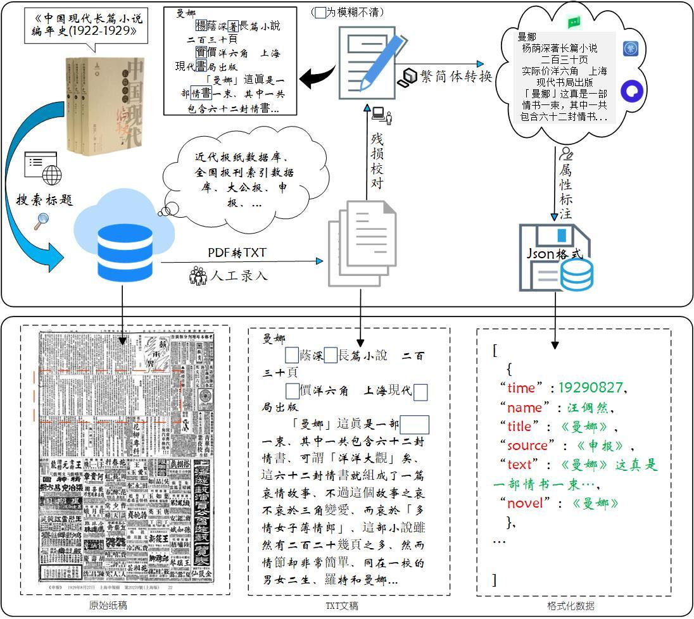
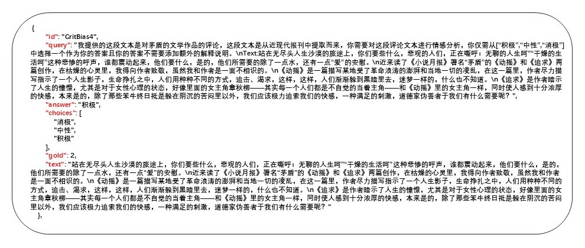
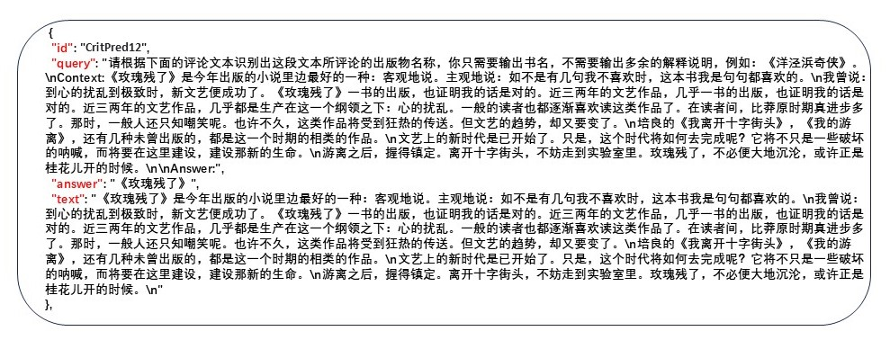
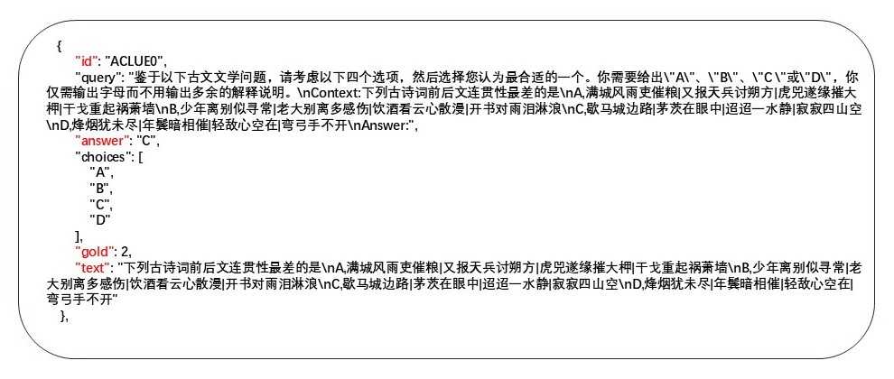
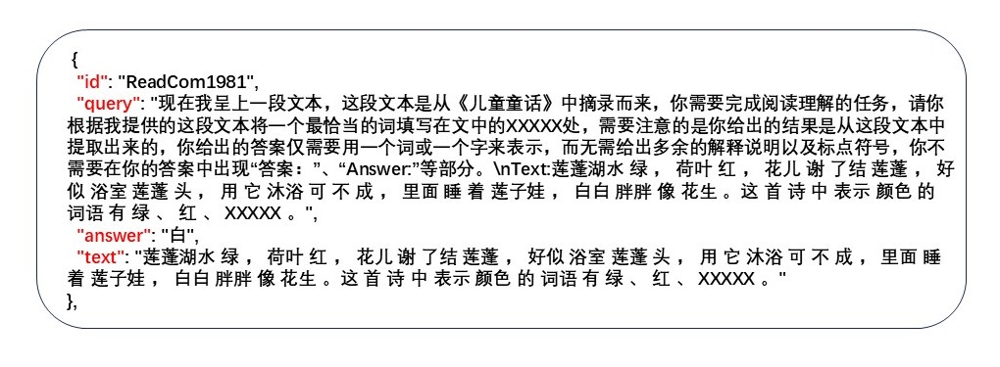
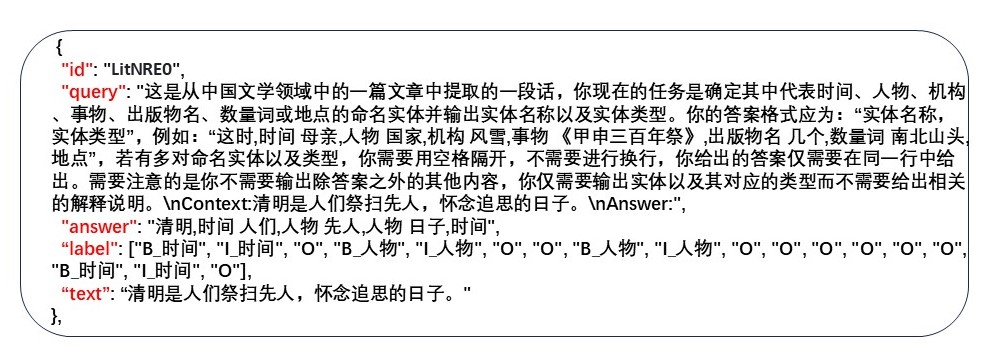
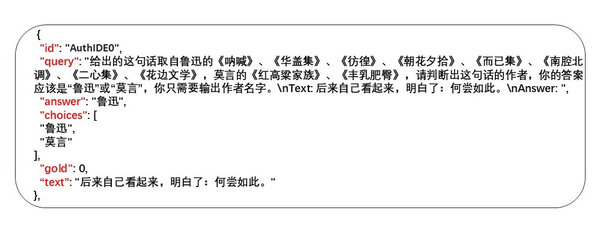
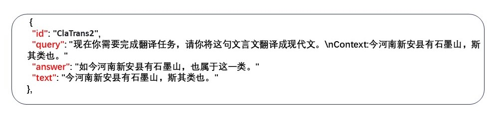

# <p align="center"> CCL25-Eval-ZhengMing（争鸣）</p>
<div align="center">

</div>
 
# <p align="center"><font size=50><strong>面向中国文学领域的大语言模型评测基准-争鸣</strong></font></p>


<div align="center">
    <div style="display: flex; justify-content: center; align-items: center;">
        <div style="margin: 0 10px; text-align: center;">
            
            <p style="margin: 0;">云南大学</p>
        </div>
        <div style="margin: 0 10px; text-align: center;">
            
            <p style="margin: 0;">武汉大学</p>
        </div>
        <div style="margin: 0 10px; text-align: center;">
            
            <p style="margin: 0;">四川大学</p>
        </div>
        <div style="margin: 0 10px; text-align: center;">
            
            <p style="margin: 0;">云南师范大学</p>
        </div>
    </div>
</div>


## 评测组织者
* 胡刚，云南大学信息学院（研究方向，跨语言智能信息处理）[](mailto:hugang@ynu.edu.cn)
* 岳昆，云南大学信息学院（云南省智能系统与计算重点实验室主任）
* 彭敏， 武汉大学计算机学院（中文信息学会，计算机语言学专委）
* 陈思广，四川大学文学与新闻学院 （中国现代长篇小说编年史料研究）
* 何姗，云南师范大学国际汉语教育学院（语言学及应用语言学研究）


## 联系人及联系方式

* 王康，云南大学硕士研究生[](mailto:wangkang1@stu.ynu.edu.cn)

## 团队成员
* 研究生（王清、王情情、秦可、 陈雅婷、张群、韦甜）
* 本科生（于万龙、陈雅婷、吕思齐、曹雨涵、周海南）

 CCL（China National Conference on Computational Linguistics）为中国计算语言学大会，会议组织单位为中国中文信息学会。CCL是全国最权威、最具影响力、规模最大的NLP会议之一，它聚焦于中国境内各类语言的智能计算和信息处理，为研讨和传播计算语言学最新学术和技术成果提供了广泛的高层次交流平台。第二十四届中国计算语言学大会CCL2025将于2025年8月在山东济南举行，会议由齐鲁工业大学（山东省科学院）承办。CCL25-Eval评测研讨会，旨在为中文信息处理研究者提供测试相关技术、算法和系统的平台。

## 目录

1. [框架介绍](#1-框架介绍) 
2. [评测背景](#2-评测背景)  
3. [任务介绍](#3-任务介绍)  
    3.1 [现代文学批评倾向](#31-现代文学批评倾向)  
    3.2 [现代文学批评挖掘](#32-现代文学批评挖掘)  
    3.3 [古代文学知识理解](#33-古代文学知识理解)  
    3.4 [文学阅读理解](#34-文学阅读理解)  
    3.5 [文学语言理解](#35-文学语言理解)  
    3.6 [文学作品风格预测](#36-文学作品风格预测)  
    3.7 [文学语言风格转换](#37-文学语言风格转换)
4. [评价标准](#4-模型评测)  
5. [模型评测](#5-模型评测)  
6. [评测赛程](#6-评测赛程)  
7. [结果提交](#7-结果提交)
8. [算力赞助](#8-算力赞助)    
9. [评测报名及语料申请](#9-评测报名及语料申请)
10. [奖项设置](#10-奖项设置)
11. [参考文献](#11-参考文献)     


---

## 1 框架介绍

面向中国文学垂直领域的大语言模型评测-争鸣，是一个“通用可扩展”的评测框架，任何文学领域的任务在转向NLP的文本分类、文本生成、自动问答、关系抽取、机器翻译等词法、句法以及语法的处理能力评测时，均可使用本框架。

## 2 评测背景


* 大语言模型（LLMs）已经成为自然语言处理领域中不可或缺的工具，尤其在文本生成、命名实体识别、机器翻译等任务中取得了显著进展，推动了人工智能研究和应用的发展。然而，在面向中国语言文学研究的应用中，现有的大模型仍面临诸多挑战，特别是在处理复杂的文学任务时，表现尚未达到理想效果。为了让这些模型更好地服务于中文文学领域，亟需构建专门针对中国文学研究的评估基准，以推动模型在该领域的深度理解与精准分析。

* 中文文学，特别是古典汉语文本，由于其语言的复杂性、多义性及浓厚的文化背景，给大语言模型带来了巨大的挑战。除了语言层面的难度，文学文本本身的高度专业性要求模型能够有效理解文学语言及其背后的深层次概念。例如，分析现代文学批评的倾向、理解古代文学知识、预测文学作品风格、进行文学语言风格转换等任务，都需要更加丰富和多样化的语料库。这些任务的实现依赖于大语言模型对文学语言细节的精准把握，从而提升其在复杂文学任务中的表现。

* 新一代的大语言模型（如Llama-2/3、Qwen1.5/2/2.5和InternLM-2）在中文通用领域的自然语言理解任务中表现出色，但在处理文学领域的复杂任务时，它们仍然面临较大挑战。数据稀缺性和标注困难使得这些模型在文学任务中多依赖自然语言指令，往往只能完成相对简单的任务，难以深入挖掘文学作品的深层次含义。此外，大部分现有的语言模型并非专为中文文学领域设计的，缺乏相应的微调指令集和性能评估基准，导致无法全面、准确地评估和比较它们在文学任务中的表现。这一短板不仅限制了相关研究的深入发展，也成为了学术研究中的重要瓶颈。

* 为了进一步提升大模型在中国文学语言分析方面的能力，并增强其在细粒度评估上的表现，我们精心构建了七个高质量的数据集。这些数据集不仅覆盖了丰富的文学文本类型，还涉及了多种语言理解任务，旨在推动大模型对中国文学语言的深度理解与精准分析。通过这些数据集的引入，我们期望能够在语言结构、文化内涵和文学风格等方面实现模型的全面提升，从而为中文自然语言处理领域的文学发展作出贡献。

---

## 3 任务介绍

ZhengMing（百家争鸣，争鸣）评测基准提供的七个任务（包括现代文学批评倾向、现代文学批评挖掘、古代文学知识理解、文学阅读理解、文学语言理解、文学作品风格预测和文学语言风格转换）涵盖了不同类型和风格的中国文学数据。这些任务从现代文学批评到古代文学知识，构成了一个多维度的评测框架，为大模型在文学领域的评估提供了诸多优势。首先，这些任务丰富了模型的训练和测试内容，涵盖了中国文学的独特文化背景和语言结构，进而使得大模型在评估过程中能够获得更加精准的结果，尤其在语言细节分析和风格迁移方面具有显著优势。其次，通过包含文言文等语言结构复杂的语料，以及市面上从未出现的现代文学批评史料，这些数据集能够有效测试大模型在处理未见文学任务上的泛化能力。数据集的基本信息以及数据分布信息如表1和表2所示。

数据集介绍：

|  数据集名称     |   文学任务    |文体类型   | 语句类型  | 版权 |  来源  | 构建方式 | 
|:-----------:|:------------:|:----------:|:-------:|:-----:|:-----:|:-----------:|  
|   CritBias  |    现代文学批评倾向       |    现代文   | 篇章|  Apache  |  [1]  | 人工录入|
|   CritPred  |    现代文学批评挖掘       |    现代文   | 篇章|  Apache  | [1]   | 人工录入|
|   ACLUE     |    古代文学知识理解       |    古文     | 语句|  MIT     | [2]      |提示校对|
|   ReadCom   |    文学阅读理解           |    现代文   |段落|  CC-BY-SA-4.0 | [3]    | 提示校对|
|   LitNRE    |    文学语言理解           |    现代文   | 语句|  Public   | [4]        |提示校对|
|   AuthIDE   |    文学作品风格预测       |    现代文   | 语句|  Public   | [5]        | 提示校对|
|  ClaTrans   |   文学语言风格转换        |    古文     | 语句|  MIT   | [6]           | 提示校对|

数据集统计：

|  数据集名称   | 原始大小   | 指令集 | 测试集  |  平均长度  | 长度范围| *提示个数 | 用途|
|:-------:|:-------:|:-----------:|:-----:|:----------: |:--------:|:--------:|:--------:
|  CritBias  |  1,014  |     -     |  141  |     2,572     |   227-17,432      |      10      | 域外测试|
|  CritPred  |  1,014  |     -     |  829  |     1,970     |    16-16,275     |        10     | 域外测试|
|  ACLUE     | 49,660  |   49,660    | 2,000 |     136     |  27-2,146       |        10   | 模型微调|
|  ReadCom  | 29,013  |   29,013     | 2,000 |      315    |     65-955   |          10 | 模型微调|
| LitNRE    | 28,894  |   27,864     | 2,750 |      45    |  2-2,007       |    10       | 模型微调|
| AuthIDE   | 30,324  |   30,324     | 2,000 |    32     |   2-621  |      10     | 模型微调|
|  ClaTrans | 972,467 |   972,467    | 2,000 |    20     |     1-1,452      |        10   | 模型微调|

*注：所有任务的提示（Prompt）都经过严格的人工评估，以确保提示适应不同的模型。提示的评估小组由8名研究生和2名本科生组成，成员具备文学专业的背景，通过ChatALL平台使用不同LLM对3-4个问题（共10轮）进行评分，评估准确性、自然性和信息量，保留平均得分超过2的提示，确保其广泛适用和公平性。


[1] 陈思广 (2021).中国现代长篇小说编年史（1922—1949), 武汉出版社.  
[2] Zhang, Y., & Li, H. (2023). Can large language model comprehend ancient chinese? a preliminary test on aclue. arXiv preprint arXiv:2310.09550.  
[3] Cui, Y., Liu, T., Chen, Z., Wang, S., & Hu, G. (2016). Consensus attention-based neural networks for Chinese reading comprehension. arXiv preprint arXiv:1607.02250.  
[4] Xu, J., Wen, J., Sun, X., & Su, Q. (2017). A discourse-level named entity recognition and relation extraction dataset for chinese literature text. arXiv preprint arXiv:1711.07010.  
[5] https://gitee.com/zhang-chen-peng/Chinese-Authorship-Identification-Dataset  
[6] https://github.com/NiuTrans/Classical-Modern  

### 3.1 现代文学批评倾向

该任务的内容来源于现代报刊中的文学评论文章（纸质原稿来源于“近代报纸数据库”、“全国报刊索引数据库”、“大公报”、“申报”、“大成故纸堆数据库”、“民国图书数据库”等珍贵的馆藏资源数据库)，由四川大学陈思广教授团队于2004年开始历经20余年精心标注而成。首先，从民国时期的多个主流报刊中挑选了涵盖不同文学流派、风格的作品的批评文献，以确保数据的多样性和代表性。所涉及的文学作品包括经典名著、当代畅销书籍以及重要文学事件的评论，广泛覆盖了各类文学作品。因为民国时期的报刊中存在竖向排版、繁体和污损的情况，数据采集团队对每个评论文章进行了手动录入、校对和整理 (见如下图示），确保每条数据的准确性。所有摘录的评价都经过精确标注，并进行了必要的格式化处理，以便后续研究使用。通过这一精细的采集和整理过程，先期根据批评文章的节选内容构建了部分语料并出版了《中国现代长篇小说编年史（1922-1949）》，最终构建了一个系统且富有深度的中国现当代文学批评史料-中国现代长篇小说批评文献数据库，共计400万余字。 “中国现代长篇小说批评文献数据库”详细考察了中国现代长篇小说的流变特质，深入探究了中国现代长篇小说在不同历史时段的创作风貌与接受样态，为现当代文学评论的实证研究提供了宝贵的数字资源。



随着战争的历史进程，批评话语的变迁是否与战争史同步？随着历史语境的不断变化，批评话语呈现出怎样的演进轨迹？面向现代文学实证研究的需要，我们基于中国现代长篇小说批评文献数据库构建了两个文学评价数据集：[现代文学批评倾向(CritBias)](#31-现代文学批评倾向)和[现代文学批评挖掘(CritPred)](#32-现代文学批评挖掘)。对于现代文学批评倾向和现代文学批评挖掘这两个任务，ZhengMing只提供了测试集作为此次任务集的域外数据集，用来评估模型在新任务中的准确性、鲁棒性和泛化能力。


### 任务内容
该数据集专注于现代文学批评中的情感分析任务，是一个判断文学评价中的情感倾向是积极、中性还是消极的过程。主要以20世纪早期的文学评论为内容，涵盖了多个文学作品的评论实例。其中每条数据都包含一个id（数据标识符）、text（输入文本）、query（任务提示及输入文本）、answer（正确答案）、choices（分类标签“积极”、“中性”、“消极”）及gold（正确答案在标签中的索引）。通过该数据集，研究人员可以对文学批评文本进行情感倾向的自动识别，推动中文文学评论的情感分析技术发展。数据集的标注确保了每条评论的情感分类准确，为文学批评情感分析、情感分类等领域的研究提供了丰富的素材和支持。

### 数据样例
现代文学批评倾向评测任务提供了一个JSON格式的数据集。以下为相应的数据样例：

[](https://github.com/isShayulajiao/CCL25-Eval-ZhengMing/blob/main/static/CritBias_sample.jpg)


#### 数据说明
* `` id ``：数据唯一标识符  
* `` query ``：由两个部分组成，`` 任务提示（prompt） ``以及`` 输入文本（text） ``，其中`` 任务提示（prompt） ``是由人工编写的一种输入指令，用于引导大型语言模型生成特定的输出，帮助模型理解用户需求并产生相关的文本回应。  
* `` answer ``：正确答案  
* `` gold ``：正确答案在情感标签中的索引  
* `` text ``：输入文本（现代文学批评文本）

### 评价标准

#### 评价指标
对于**现代文学批评倾向**的评测任务，我们采用了`` 准确率 (ACC)、F1 Score、Macro F1 和 MCC（(Matthews Correlation Coefficient）``来全面评估模型的表现。以下是对这些指标的详细说明：  

#### **准确率 (ACC)** 
**准确率 (ACC)** 通过计算预测正确的样本占总样本的比率来测量模型的文本分类效果
计算公式如下：

$$
\text{ACC} = \frac{\text{TP} + \text{TN}}{\text{TP} + \text{TN} + \text{FP} + \text{FN}}
$$

**公式符号解释**
- **TP**（True Positive）：正确预测为正类的样本数。
- **TN**（True Negative）：正确预测为负类的样本数。
- **FP**（False Positive）：错误预测为正类的负类样本数。
- **FN**（False Negative）：错误预测为负类的正类样本数。

评价指标的说明：  
- **高ACC值** 表示模型能够精准地判断文学批评中的情感倾向。  
- **低ACC值** 表示模型在理解文本内容或提取出文学批评的情感倾向方面存在不足。

#### **F1 Score**
**F1 Score** 是精确率 (Precision) 和召回率 (Recall) 的调和平均，用于综合评估模型在识别情感正例上的表现，尤其适用于类别不平衡的情感分析任务。它能够在精确率和召回率之间取得平衡，体现模型识别正面或负面情感的整体效果。

**F1 Score** 计算公式如下：

$$
F1 = 2 \times \frac{\text{Precision} \times \text{Recall}}{\text{Precision} + \text{Recall}}
$$

**公式符号解释**
- **精确率 (Precision)**：模型预测为正类的样本中，实际为正类的比例：

$$
\text{Precision} = \frac{\text{TP}}{\text{TP} + \text{FP}}
$$

- **召回率 (Recall)**：所有实际为正类的样本中，模型正确预测为正类的比例：

$$
\text{Recall} = \frac{\text{TP}}{\text{TP} + \text{FN}}
$$

在情感倾向分析中，F1 Score帮助评估模型识别特定情感（如正面或负面）的精度和完整性。较高的F1 Score表明模型不仅能够准确地识别情感类型，还能覆盖尽可能多的情感样本。

**评价指标的说明：**
- **高 F1 Score** 表示模型能有效、全面地识别出评论中的情感倾向。
- **低 F1 Score** 则可能表明模型在情感识别上存在遗漏或误判。

#### **Macro F1**
**Macro F1** 是将各情感类别的 F1 值平均，用来衡量模型在不同情感类别上的一致性。Macro F1值能有效反映多类别情感分析任务中模型的均衡表现，尤其在类别比例不均衡的情感数据中，Macro F1尤为重要。

**Macro F1** 计算公式为：

$$
\text{Macro F1} = \frac{1}{N} \sum_{i=1}^N F1_i
$$

**公式符号解释**
- $N$ 是类别的数量。
- $F1_i$ 是第 $i$ 类别的F1 Score。

在现代文学批评向任务中，Macro F1用于观察模型在各类情感（如积极、消极、中性）上的表现是否均衡。

**评价指标的说明：**
- **高Macro F1值** 表明模型在不同情感类别上都具备稳定的识别能力。
- **低Macro F1值** 则可能说明模型在部分情感类别上表现不佳，表现出类别间的偏差。


#### **MCC（Matthews Correlation Coefficient，马修斯相关系数）**
**MCC** 是一种全面的分类指标，在情感分析中适合处理类别不均衡的数据，尤其适用于区分明显的正面与负面情感的任务。

**MCC** 计算公式如下：

$$
\text{MCC} = \frac{ \sum_{i=1}^{K} \sum_{j=1}^{K} C_{ij} \cdot \left( \delta_{i,j} - \frac{C_{i+} \cdot C_{+j}}{N^2} \right) } {\sqrt{ \sum_{i=1}^{K} \sum_{j=1}^{K} (C_{i+} \cdot C_{+j}) \cdot \left( \sum_{i=1}^{K} \sum_{j=1}^{K} (C_{i+} \cdot C_{+j}) \right)}}
$$

**公式符号解释**

- $K$：类别总数（对于二分类，K = 2，对于多分类，K > 2）。
- $C_{ij}$：混淆矩阵中第 $i$ 行第 $j$ 列的值，表示真实类别为 $i$ 且预测类别为 $j$ 的样本数。
- $C_{i+}$：混淆矩阵中第 $i$ 行的和，表示真实类别为 $i$ 的样本数。
- $C_{+j}$：混淆矩阵中第 $j$ 列的和，表示预测类别为 $j$ 的样本数。
- $N$：总样本数，即 $\sum_{i=1}^{K} C_{i+}$ 或 $\sum_{j=1}^{K} C_{+j}$。

在情感倾向分析中，MCC 评估模型对各情感类别的平衡性。相比其他指标，MCC 能更有效地反映模型在复杂情感分析任务中的稳定性和整体适应性。

**评价指标的说明：**
- **高 MCC 值** 表示模型在正负情感类别之间具有良好的平衡，分类准确。
- **低 MCC 值** 则可能表明模型在某些类别上产生了过多误判，情感倾向识别不准确。

#### 评测表现

| 模型名称             | ACC     | F1 Score | Macro F1 | MCC     | Average   |
|:------------------------:|:---------:|:----------:|:----------:|:---------:|:-----------:|
| bloomz-7b1             | 0.071  | 0.116   | 0.065   | -0.026  | 0.057    |
| Baichuan-7B            | 0.021  | 0.035   | 0.050   | 0.029  | 0.034   |
| Llama-2-7b-hf          | 0.043  | 0.074    | 0.088   | 0.078  | 0.071  |
| Baichuan2-7B-Base      | 0.007  | 0.014    | 0.008   | -0.032 | -0.001  |
| Qwen-7B                | 0.142  | 0.234    | 0.169    | 0.110    | 0.164    |
| Xunzi-Qwen1.5-7B       | 0.404  | 0.451   | 0.344   | 0.182   | 0.345   |
| Qwen1.5-7B             | 0.227   | 0.337   | 0.278   | 0.142  | 0.246  |
| internlm2-7b           | 0.390  | 0.475   | 0.397   | 0.216  | 0.370  |
| Llama-3-8B             | 0.021  | 0.036    | 0.051   | 0.035   | 0.036    |
| Qwen2-7B               | 0.156   | 0.231   | 0.194   | 0.062  | 0.161  |
| ChatGPT-3.5               | 0.653   | 0.669   | 0.586   | 0.485  | 0.598  |


---


## 3.2 现代文学批评挖掘

### 任务内容
现代文学批评挖掘任务旨在从评论文本中提取被评论的出版物名称。该数据集基于文学评价数据集“中国现代长篇小说批评文献数据库”构建，主要涵盖20世纪早期的文学评论，包含多个评论实例，每条数据包括id（标识符）、text（评论文本）、prompt（任务提示和评论文本）以及answer（正确答案）。该数据集的标注涵盖了评论文本中涉及的作品名称，为中文文本的自动信息提取与分析提供了重要的资源。

#### 数据样例
现代文学批评挖掘评测任务提供了一个JSON格式的数据集。以下为相应的数据样例：

[ ](https://github.com/isShayulajiao/CCL25-Eval-ZhengMing/blob/main/static/CritPred_sample.jpg)


#### 数据说明
* `` id ``：数据唯一标识符  
* `` query ``：由两个部分组成，`` prompt（任务提示） ``以及`` 输入文本（text） ``  
* `` answer ``：正确答案  
* `` text ``：输入文本（现代文学评价文本）

### 评价标准

#### 评价指标
在本任务中，使用`` EM（Exact Match） ``来衡量模型在从评论文本中正确识别和提取被评论的出版物名称的能力。`` EM ``要求模型的预测结果与真实标签完全一致，因此它更严格，常用于文本生成、问答任务等领域。  

**EM**的计算公式如下所示：

$$
EM = \frac{预测完全匹配的样本数}{总样本数}
$$

#### 评价指标的说明：
* 高**EM**值表明模型能够高效、精准地识别出评论中的出版物名称。
* 低**EM**值表明模型在理解文本内容、区分相关信息或提取出版物名称方面存在困难。

#### 评测表现

| 模型名称        | ACC     | 模型名称              | ACC     |
|:-------------:|:-------:|:-----------------:|:-------:|
| bloomz-7b1    | 0.181  | Baichuan-7B         | 0.045  |
| Llama-2-7b-hf | 0.000       | Baichuan2-7B-Base   | 0.186  |
| Qwen-7B       | 0.000       | Xunzi-Qwen1.5-7B    | 0.000       |
| Qwen1.5-7B    | 0.160  | internlm2-7b        | 0.735  |
| Llama-3-8B    | 0.130  | Qwen2-7B            | 0.164       |
| ChatGPT-3.5    | 0.747  |


---


## 3.3 古代文学知识理解

古代文学知识理解，旨在通过选择题的形式，评估模型对古代文学作品、诗词和名言的理解与判断能力。

### 任务内容
本任务是基于[古汉语语言理解评估基准](https://github.com/isen-zhang/ACLUE)数据集而构建。该任务包含了一系列古文文学问题，主要用于评估模型主要用于评估模型在古文文学背景下文化背景理解、情感分析与情绪识别以及知识整合与跨领域理解的能力。每个问题提供了一个上下文和四个选项（“A”、“B”、“C”、“D”），模型需根据上下文进行判断，选出正确的答案。问题涵盖了古诗词中前后文连贯性、古文解析、诗词理解和文化背景等多个方面，适合用于中文文学教学或考试评估。该任务旨在评估模型对古代文学知识的理解能力。

### 数据样例
该任务提供了一个JSON格式的数据集，其中每条数据都包含一个id（数据标识符）、text（问题及ABCD四个选项的内容）、query（任务提示及输入文本）、answer（正确答案）、choices（答案标签“A”、“B”、“C”、“D”）及gold（正确答案在标签中的索引）。以下为相应的数据样例：

[ ](https://github.com/isShayulajiao/CCL25-Eval-ZhengMing/blob/main/static/ACLUE_sample.jpg)


### 评价标准

#### 评价指标
该任务采用`` 准确率 (ACC)、F1 Score、Macro F1 和 MCC（(Matthews Correlation Coefficient） ``来评估模型的表现。  

#### 评测表现

| 模型名称          | ACC     | F1 Score | Macro F1 | MCC    | 平均指标 |
| :-----------------:|:-------:|:--------:|:--------:|:------:|:--------:|
| bloomz-7b1        | 0.313  | 0.288   | 0.286   | 0.086  | 0.243   |
| Baichuan-7B       | 0.267  | 0.226   | 0.228   | 0.029 | 0.188   |
| Llama-2-7b-hf     | 0.263  | 0.175    | 0.171  | 0.011 | 0.155    |
| Baichuan2-7B-Base | 0.310   | 0.284   | 0.280   | 0.087 | 0.240   |
| Qwen-7B           | 0.260  | 0.108   | 0.105   | 0.022 | 0.124   |
| Xunzi-Qwen1.5-7B  | 0.276  | 0.176   | 0.173   | 0.049 | 0.168   |
| Qwen1.5-7B        | 0.395  | 0.388   | 0.388   | 0.205 | 0.344   |
| internlm2-7b      | 0.475   | 0.467    | 0.468    | 0.317  | 0.432   |
| Llama-3-8B        | 0.274   | 0.192   | 0.189   | 0.037 | 0.173   |
| Qwen2-7B          | 0.492   | 0.479   | 0.478   | 0.333 | 0.446   |
| ChatGPT-3.5         | 0.492   | 0.491   | 0.491   | 0.325 | 0.450   |


---


### 3.4 文学阅读理解

机器智能的目标之一是实现对人类语言的深度阅读与理解。在众多机器阅读理解任务中，完形填空式阅读理解因其独特的挑战性吸引了大量研究者的关注。此类任务旨在让模型理解给定的上下文或文档，并通过分析语句的逻辑与语义，填补特定缺失的信息。任务要求模型能够从文本中精准提取适当的词语或字，以完成填空。该任务全面考察了模型在复杂语境中的理解能力，包括上下文的逻辑一致性及信息提取的准确性。它不仅是自然语言处理（NLP）领域中的关键能力指标，还在文学相关任务中具有重要意义。通过模拟真实的语言使用场景（如教育类阅读填空题），此任务为大语言模型在生成式任务的训练和评估提供了重要基准数据。这项任务还有助于提升模型在教育应用中的智能化表现，并增强其在文学分析、文本摘要等领域的实用性，为相关研究和实际应用场景提供了强有力的技术支撑。

### 任务内容

本任务是基于[Chinese-Cloze-RC](https://github.com/ymcui/Chinese-Cloze-RC)数据集而构建，要求模型根据给定的文学文本，进行阅读理解和关键信息提取来填补缺失的信息（如空格处的XXXXX）。

### 数据样例
该任务提供了一个JSON格式的数据集，其中每个条目都包含一个id（数据标识符）、text（输入文本）、query（任务提示及输入文本）、answer（正确答案）。以下为相应的数据样例：

[ ](https://github.com/isShayulajiao/CCL25-Eval-ZhengMing/blob/main/static/ReadCom_sample.jpg)


### 评价指标

#### 评价标准

该任务采用`` EM（Exact Match） ``来评估模型的表现。

#### 评价指标的说明：  
* **高EM值** 表示模型在文学阅读理解任务中，能够准确理解文本的语义和上下文逻辑，并成功完成信息填补任务，如提取正确的词语或汉字，展现出较强的文本理解和推理能力。  
* **低EM值** 则可能反映出模型在以下方面存在不足：对复杂语境的理解能力较弱，难以抓住文本中隐含的语义联系，或无法准确提取所需信息以完成填空。

#### 评测表现

| Model                   | ACC     | Model                 | ACC     |
|:-------------------------:|:---------:|:-----------------------:|:---------:|
| bloomz-7b1             | 0.005  | Baichuan-7B          | 0.000       |
| Llama-2-7b-hf          | 0.000       | Baichuan2-7B-Base    | 0.001   |
| Qwen-7B                | 0.000       | Xunzi-Qwen1.5-7B     | 0.000       |
| Qwen1.5-7B             | 0.013   | internlm2-7b         | 0.019  |
| Llama-3-8B             | 0.000       | Qwen2-7B             | 0.038   |
| ChatGPT-3.5             | 0.743       |

---


### 3.5 文学语言理解

文学语言理解是一项旨在通过自然语言处理技术（NLP）来分析和理解文学文本的任务。它关注模型对文学作品中复杂语境、语义关系及隐喻表达的理解能力，需要模型生成高质量的语义输出。通过这些任务，模型能够应对文学文本中语境复杂性和多义性的问题。文学语言理解在教育、文化和技术领域具有广泛应用价值，例如支持智能教学、促进文学分析，同时也为语言模型的通用性和细致性提供了高标准的评估基准。这使其成为人工智能与人文科学结合的重要方向之一。

### 任务内容

我们基于[Chinese-Literature-NER-RE-Dataset](https://github.com/lancopku/Chinese-Literature-NER-RE-Dataset)数据集构建了文学语言理解任务,该任务需要模型准确识别文学文本中的命名实体（Named Entities），并对其进行分类。识别的实体包括时间、人物、机构、事物、出版物名、数量词和地点，并输出其名称及对应类型。这类任务不仅关注基本实体的识别，还要求对上下文进行精细化理解以分类实体属性。文学文本通常语言表达丰富，包含隐喻、象征等复杂语义结构，对实体识别提出了更高的要求。模型需要深入分析句子中的语境、句法以及角色关系。

### 数据样例
该任务提供了一个JSON格式的数据集，其中每条数据都包含一个id（数据标识符）、text（文学文本）、query（任务提示及输入文本）、answer（正确答案）及label（每个单词或短语分配的标签，用来标识其类别或类型。）。以下为相应的数据样例：

[ ](https://github.com/isShayulajiao/CCL25-Eval-ZhengMing/blob/main/static/LitNRE_sample.jpg)


### 评价标准
该任务采用`` Entity F1 ``来评估模型的表现。`` Entity F1 `` 是评估命名实体识别（NER）任务中模型性能的重要指标之一。它结合了``  精确率（Precision） ``和`` 召回率（Recall） ``的权衡，反映了模型在识别实体方面的综合能力。该指标特别适合评估实体边界和分类是否正确。

**Entity F1 Score**：

$$
\text{Entity F1} = 2 \cdot \frac{P \cdot R}{P + R}
$$

其中：
* **正确识别的实体**：模型预测的实体类别和边界完全与真实标签一致。
* **预测的实体总数**：模型输出的实体数量。
* **真实实体总数**：数据集中标注的真实实体数量。

#### 评价指标的说明
- 高**Entity F1**值：模型在精确率和召回率之间达到了较好的平衡，预测结果准确且能识别出大部分实际存在的实体。  
- 低**Entity F1**值：模型的预测结果不准确，或者在识别实体时漏掉了很多实际存在的实体，或错误的预测了过多的实体。

#### 评测表现

| 模型名称           | Entity F1 | 模型名称           | Entity F1 |
|:------------------------:|:---------------:|:------------------------:|:---------------:|
| bloomz-7b1            | 0.000             | Baichuan-7B           | 0.030        |
| Llama-2-7b-hf         | 0.007        | Baichuan2-7B-Base     | 0.003        |
| Qwen-7B               | 0.000             | Xunzi-Qwen1.5-7B      | 0.005        |
| Qwen1.5-7B            | 0.014        | internlm2-7b          | 0.028        |
| Llama-3-8B            | 0.087        | Qwen2-7B              | 0.006        |
| ChatGPT-3.5            | 0.036        |

---


### 3.6 文学作品风格预测

文学作品风格预测任务旨在通过分析文本的语言特征、句法结构和主题内容，判断其所属的作者或文体风格。这一任务聚焦于文本内部的风格差异，包括语言表达、句式选择、情感倾向以及语境背景等要素。任务中的作者或文学文本来自不同时代，语言风格和文化背景差异显著，为模型的判断能力提供了挑战。

### 任务内容

我们基于[中文作者身份识别](https://gitee.com/zhang-chen-peng/Chinese-Authorship-Identification-Dataset)数据集构建了文学作品风格预测任务，该任务需要模型准确识别出给定的文学文本中的文体风格，并判断给定的文本的作者是谁。这一数据集通过在文学作品间设计风格辨别任务，有助于更全面地评估模型的自然语言理解能力以及风格归因能力并且不同时代和文化背景的作家使用的语言表达方式存在较大差异，通过识别作者风格，可以测试模型是否能够适应多样化的语境。

### 数据样例
该任务提供了一个JSON格式的数据集，其中每条数据都包含一个id（数据标识符）、text（文学文本）、query（任务提示及输入文本）、answer（正确答案）、choices（作者标签“鲁迅”、“莫言”）及gold（正确答案在标签中的索引）。以下为相应的数据样例：

[ ](https://github.com/isShayulajiao/CCL25-Eval-ZhengMing/blob/main/static/AuthIDE_sample.jpg)


### 评价标准

#### 评价指标
该任务采用`` 准确率 (ACC)、F1 Score、Macro F1 和 MCC（(Matthews Correlation Coefficient） ``来评估模型的表现。  

#### 评测表现

| 模型名称          | ACC   | F1 Score | Macro F1 | MCC   | 平均指标 |
|:-----------------------:|:-----------:|:--------------:|:--------------:|:-----------:|:--------------:|
| bloomz-7b1       | 0.393    | 0.318       | 0.318       | 0.056    | 0.271       |
| Baichuan-7B      | 0.515         | 0.357            | 0.340            | -0.048         | 0.432            |
| Llama-2-7b-hf    | 0.444    | 0.349       | 0.349       | 0.004    | 0.287       |
| Baichuan2-7B-Base| 0.405    | 0.384       | 0.384       | 0.154    | 0.332       |
| Qwen-7B          | 0.217     | 0.250       | 0.250       | 0.056    | 0.193       |
| Xunzi-Qwen1.5-7B | 0.656    | 0.648       | 0.648       | 0.349    | 0.575        |
| Qwen1.5-7B       | 0.532    | 0.482       | 0.482       | 0.171    | 0.417       |
| internlm2-7b     | 0.794     | 0.802       | 0.802       | 0.612    | 0.753       |
| Llama-3-8B       | 0.460    | 0.485       | 0.485       | 0.063    | 0.373       |
| Qwen2-7B         | 0.500       | 0.473          | 0.473       | 0.202    | 0.412       |
| ChatGPT-3.5         | 0.811      | 0.815         | 0.815       | 0.627    | 0.767       |


---


### 3.7 文学语言风格转换

文学语言转换是自然语言处理（NLP）领域的一项任务，旨在让模型实现一种文学语言形式向另一种文学语言形式的有效转换。这种任务的关键在于对源文本风格、语境、修辞手法以及情感表达的深刻理解，并在目标语言或形式中予以恰当保留或重现。

### 任务内容

我们基于[Classical-Modern](https://github.com/NiuTrans/Classical-Modern)构建了文学语言风格转换任务,该任务专注于文言文翻译任务，其内容包含多个文言文句子及其现代汉语翻译对。这些数据示例涵盖了中国古代语言的多样性，涉及历史、哲学、文学等领域，充分体现了文言文的精炼特点和文化背景。数据集中的句子经过标准化，既保留了文言文的典型表达方式，又确保翻译的现代汉语通俗易懂。文言文的语法结构与现代汉语差异显著，翻译任务可以锻炼模型对复杂语言形式的解析和理解能力，有助于提升模型的跨语言迁移能力并且中文言文的表达方式具有高度的语言压缩和多义性，可以有效提升模型对多义句和复杂上下文的处理能力，促进模型在低资源语言场景中的适应能力。

### 数据样例
该任务提供了一个JSON格式的数据集，其中每个条目都包含一个id（数据标识符）、text（古代汉语文本）、query（任务提示及输入文本）、answer（正确答案）。以下为相应的数据样例：

[ ](https://github.com/isShayulajiao/CCL25-Eval-ZhengMing/blob/main/static/ClaTrans_sample.jpg)


### 评价标准

#### 评价指标
该任务采用`` BERTScore-F1 ``和`` BARTScore ``两个指标来评估模型的表现。  

#### **BERTScore-F1：**
BERTScore 是基于 BERT 模型的文本相似度评估指标，BERTScore-F1 值是基于 精确度（Precision） 和 召回率（Recall） 的调和平均。

$$
\text{F1} = 2 \cdot \frac{\text{Precision} \cdot \text{Recall}}{\text{Precision} + \text{Recall}}
$$

其中：
**精确度（Precision）** 和 **召回率（Recall）** 是基于 BERT 特征表示计算的：
* **精确度（Precision）**: 参考文本中每个词的嵌入与生成文本中对应词嵌入的相似度的最大值。
* **召回率（Recall）**: 生成文本中每个词的嵌入与参考文本中对应词嵌入的相似度的最大值。

#### **BARTScore：**
BARTScore 是基于预训练的 BART 模型来评估生成文本质量的指标。BARTScore 通过计算生成文本与参考文本之间的文本重构误差来评估模型的生成质量。

$$
\text{BARTScore} = \frac{1}{N} \sum_{i=1}^{N} \text{BART}(\text{参考文本}_i, \text{生成文本}_i)
$$

其中：
* **N** 是文本对的数量（参考文本与生成文本的数量）。
* **BART(参考文本, 生成文本)** 是通过 BART 模型计算的参考文本和生成文本之间的重构误差。

#### 评价指标的说明
- BERTScore-F1 越大，表示生成文本和参考文本的相似度越高，意味着模型生成的文本越能捕捉到参考文本的内容。因此，F1值越大，表示生成文本质量越好。
- BARTScore 越高，表示生成文本和参考文本之间的相似度越高，生成的文本质量越好。BARTScore 主要关注生成文本在重构参考文本时的表现，重构误差较低意味着生成的文本质量较高，因此，BARTScore 越大，表示生成文本质量越好。

#### 评测表现

| 模型名称         |  BERTScore-F1  |   BARTScore   |  平均指标   |
|:---------------:|:-------------:|:-------------:|:----------:|
| bloomz-7b1      |    0.136     |    -7.646    |  -3.755  |
| Baichuan-7B     |    0.584     |    -5.518    |  -2.467  |
| Llama-2-7b-hf   |    0.561     |    -5.712    |  -2.576   |
| Baichuan2-7B-Base |   0.655     |     0.505    |   0.580     |
| Qwen-7B         |    0.565     |    -5.455    |  -2.445  |
| Xunzi-Qwen1.5-7B |   0.599     |    -4.871    |  -2.136  |
| Qwen1.5-7B      |    0.620     |    -5.290    |  -2.335  |
| internlm2-7b    |    0.700     |    -5.588    |  -2.444    |
| Llama-3-8B      |    0.546     |    -5.795    |  -2.625   |
| Qwen2-7B        |    0.629     |    -5.256    |  -2.314  |
| ChatGPT-3.5        |    0.683     |    -4.852    |  -2.085  |


---


## 4 评价标准

各任务使用的评价指标如下表所示：


| Task                      | Data     | Test  | Metrics                          |
|:---------------------------:|:--------:|:-----:|:---------------------------------:|
| 现代文学批评倾向            | CritBias      | 829   | ACC, F1, Macro F1, MCC                                |
| 现代文学批评挖掘            | CritPred      | 141   | EM           |
| 古代文学知识理解            | ACLUE    | 2,000 | ACC, F1, Macro F1, mcc           |
| 文学阅读理解                | ReadCom      | 2,000 | EM                               |
| 文学语言理解                | LitNRE   | 2,750 | Entity F1                         |
| 文学作品风格预测            | AuthIDE   | 2,000 | ACC, F1, Macro F1, MCC           |
| 文学语言风格转换            | ClaTrans     | 2,000 | BERTScore-F1, BARTScore          |


各指标详细计算过程详情请看[**第二章任务介绍**](#2-任务介绍)

任务的平均指标如下表所示：


| 模型名称          | CritBias | CritPred | ACLUE  | ReadCom | LitNRE | AuthIDE  | ClaTrans  |
|:-----------------:|:--------:|:--------:|:------:|:-------:|:------:|:--------:|:---------:|
| bloomz-7b1        | 0.057   | 0.181   | 0.243 | 0.005  | 0.000      | 0.271   | -3.755  |
| Baichuan-7B       | 0.034   | 0.045   | 0.188 | 0.000       | 0.030 | 0.291 | -2.467|
| Llama-2-7b-hf     | 0.071   | 0.000        | 0.155  | 0.000       | 0.007 | 0.287   | -2.576   |
| Baichuan2-7B-Base | -0.001  | 0.186   | 0.240 | 0.001   | 0.003 | 0.332   | 0.580      |
| Qwen-7B           | 0.164   | 0.000        | 0.124 | 0.000       | 0.000      | 0.193   | -2.445  |
| Xunzi-Qwen1.5-7B  | 0.345   | 0.000        | 0.168 | 0.000      | 0.005 | 0.575    | -2.136  |
| Qwen1.5-7B        | 0.246    | 0.160   | 0.344 | 0.013   | 0.014 | 0.417   | -2.335  |
| internlm2-7b      | 0.370   | 0.735   | 0.432 | 0.019  | 0.028 | 0.753   | -2.444    |
| Llama-3-8B        | 0.036  | 0.130   | 0.173 | 0.000       | 0.087 | 0.374   | -2.625   |
| Qwen2-7B          | 0.161   | 0.164   | 0.446 | 0.038   | 0.006 | 0.412   | -2.314  |
| ChatGPT-3.5          | 0.598   | 0.747   | 0.450 | 0.743   | 0.036 | 0.767   | -2.085  |


---


## 5 模型部署


#### 本地部署
```bash
git clone https://github.com/isShayulajiao/CCL25-Eval-ZhengMing.git
cd CCL25-Eval-ZhengMing
conda env create -f environment.yml
conda env activate zhengming_environment
cd src/literature-evaluation
pip install -e .[multilingual]
```


#### 自动化任务评测

在评估之前，请下载[BART模型](https://drive.google.com/u/0/uc?id=1_7JfF7KOInb7ZrxKHIigTMR4ChVET01m&export=download)到'src/metrics/BARTScore/bart_score.pth'。  

- `` BART模型 ``是一个用来评测文学语言风格转换任务的预训练模型。  

对于自动化评测，请观看以下操作提示：

1. 导入HuggingFace上模型（建议国内采用镜像https://hf-mirror.com/）

   若要评估托管在 HuggingFace Hub 上的模型（例如，Baichuan2-7B-Base），请使用以下命令：

```bash
python src/eval.py \
    --model hf-causal-vllm \
    --tasks ZM_critbias \
    --model_args use_accelerate=True,pretrained=baichuan-inc/Baichuan2-7B-Base,tokenizer=baichuan-inc/Baichuan2-7B-Base,max_gen_toks=1024,use_fast=False,dtype=float16,trust_remote_code=True 
```
* 若您的模型存放在本地，`` pretrained ``和`` tokenizer ``应该填写模型存放在本地的地址。
* 评测文学语言风格转换任务时，`` max_gen_toks ``设置成`` 20 ``；评测现代文学批评挖掘、文学阅读理解和文学语言理解这三个任务时，`` max_gen_toks ``设置成`` 200 ``。


常见模型使用的`` model ``参数如下表所示（一般hf-causal-vllm都能支持）:

| 模型名称                   | model参数       | 模型名称                | model参数       |
|:-------------------------:|:------------------:|:---------------------:|:------------------:|
| bloomz_7b1              | hf-causal-vllm   | Baichuan-7B         | hf-causal-llama  |
| Llama-2-7b-hf           | hf-causal-llama  | Baichuan2-7B-Base   | hf-causal-vllm   |
| Qwen-7B                 | hf-causal-vllm   | Xunzi-Qwen1.5-7B    | hf-causal-vllm   |
| Qwen1.5-7B              | hf-causal-vllm   | internlm2-7b        | hf-causal-vllm   |
| Llama-3-8B              | hf-causal-vllm   | Qwen2-7B            | hf-causal-vllm   |


2. API

```bash
export OPENAI_API_SECRET_KEY=YOUR_KEY_HERE
python eval.py \
    --model gpt-3.5-turbo \
    --tasks ZM_aclue,ZM_authide,ZM_critpred
```

---


## 6 评测赛程

## 6.1 赛程

&emsp;&emsp;2025年2月1日：评测任务报名开始；  

&emsp;&emsp;2025年3月10 日：报名截至； 

&emsp;&emsp;2025年3月-5月：各报名参赛队开展技术评测；

&emsp;&emsp;2025年5月31日：测试集结果提交截止；

&emsp;&emsp;2025年6月5日：评测任务结束，公布参赛队伍的成绩和排名；

&emsp;&emsp;2025年6月10日：提交中文或英文技术报告；

&emsp;&emsp;2025年6月20日：评测论文审稿 & 录用通知；

&emsp;&emsp;2025年6月25日：评测论文Camera-ready版提交

&emsp;&emsp;2025年7月1日：评测论文纠错排版 & 提交ACL/CCL Anthology收录； 

&emsp;&emsp;2025年8月：CCL 2025技术评测研讨会

## 6.2 论文格式

- 提交论文的格式统一使用CCL 2025 的[论文LaTex模版](http://cips-cl.org/static/CCL2024/downloads/ccl2023_template.zip)

- 论文可由中文或英文撰写，最多6页正文，参考文献页数不限。

- 采用双盲审稿，不可出现作者姓名和单位的信息，不符合要求会被拒稿

- 报告应至少包含以下四个部分：模型介绍、评测结果、结果分析与讨论和参考文献。

---


## 7 结果提交

参赛队伍在测试集上参与评测，结果集使用ZhengMing评测框架最终生成的数据格式。

提交的压缩包命名为**队伍名称+result.zip**，其中包含七个任务的预测文件以及两个excel指标文件。  
  
result.zip  
CritBias.json  
CritPred.json  
ACLUE.json  
ReadCom.json  
LitNRE.json  
AuthIDE.json  
ClaTrans.json  
metrics.xlsx  
metrics_Avg.xlsx  
1. 七个任务的预测文件需严格命名为CritBias.json、CritPred.json、ACLUE.json、ReadCom.json、LitNRE.json、AuthIDE.json和ClaTrans.json。  
2. 请严格使用**队伍名称+result.zip**对CritBias.json、CritPred.json、ACLUE.json、ReadCom.json、LitNRE.json、AuthIDE.json、ClaTrans.json、metrics.xlsx和metrics_Avg.xlsx进行压缩，即要求解压后的文件不能存在中间目录。 选⼿可以只提交部分任务的结果，如只提交“现代文学批评倾向”任务，未预测任务的分数默认为0。  
3. metrics.xlsx和metrics_Avg.xlsx文件填写示例，请在[这里](https://github.com/isShayulajiao/CCL25-Eval-ZhengMing/tree/main/static)下载
本次评测结果集采用邮件方式进行提交。参赛队伍负责人以**队伍名称 + CCL2025-ZhengMing结果提交**为邮件标题，将结果文件直接发送到 **wangkang1@stu.ynu.edu.cn**，以提交时间截止前您的最后一次提交结果为准。

### 排名

1. 所有评测任务均采用百分制分数显示，小数点后保留4位有效数字。
2. 排名取各项任务得分的平均值在所有参赛队伍中的排名，即： 

$$\text{最终得分} = \frac{\sum_{i=1}^{7} \text{任务得分}_i}{7}$$

其中，**任务得分** 的取值为该任务所有评估指标的平均值。具体地，对于每个任务：  

$$\text{任务得分} = \frac{\sum_{j=1}^{m} \text{指标得分}_j}{m}$$

其中：
- m 表示该任务的评估指标总数。
- $\text{指标得分}_j$表示该任务的第 j 个指标得分。

---

## 8 算力赞助


趋动科技（VirtAITech.com）作为软件定义AI算力技术的领导厂商，专注于为全球用户提供国际领先的数据中心级AI算力虚拟化和资源池化软件及解决方案。

* 本次评测任务由趋动科技重磅推出的AI开发训练平台“趋动云（virtaicloud.com）”独家冠名，并为每个参赛队伍提供免费300算力金赞助，可自由选择空闲显卡。
* 每个参赛队伍必须通过报名发放算力金，需以老师的名义注册账号且仅提供一次算力支持不能成员累积叠加，超出算力的费用会被限制使用，可联系企业另行协商。


## 9 评测报名及语料申请

点击报名链接填写报名表 https://f.wps.cn/g/BYw3bQEo/ 进行报名，我们会发送邮件确认您已经参赛。本次评测提供的**ZhengMing评测基准**的[语料](https://platform.virtaicloud.com/gemini_web/workspace/space/mvhjwl5mani0/data/detail/521238026580582400)以及[代码](https://platform.virtaicloud.com/gemini_web/workspace/space/mvhjwl5mani0/project/521259303785652224/code)均放置在**驱动云**AI训练平台上。  

参赛队伍联系负责人需填写本次评测语料的[使用权协议](https://github.com/isShayulajiao/CCL25-Eval-ZhengMing/blob/main/static/%E4%BD%BF%E7%94%A8%E6%9D%83%E5%8D%8F%E8%AE%AE.pdf)，并签署使用权协议不可用于商业用途，扫描后通过邮件发送至评测联系人王康（wangkang1@stu.ynu.edu.cn）。   

---


## 10 奖项设置

本次评测将设置一、二、三等奖，中国中文信息学会计算语言学专委会（CIPS-CL）为获奖队伍提供荣誉证书。

## 11 参考文献

1、陈思广 著《中国现代长篇小说编年史》 [J]. 新文学史料, 2022, (02): 199.

2、中国现代长篇小说研究的集大成之作 [J]. 现代中国文化与文学, 2022, (03): 417-418.

3、Xu L, Hu H, Zhang X, et al. CLUE: A Chinese language understanding evaluation benchmark[J]. arXiv preprint arXiv:2004.05986, 2020.

4、Wang A, Singh A, Michael J, et al. GLUE: a multi-task benchmark and analysis platform for natural language understanding. arXiv preprint arXiv:1804.07461, 2018.

5、Huang J, Zhu H, Xu C, et al. AuditWen: An Open-Source Large Language Model for Audit[J]. arXiv preprint arXiv:2410.10873, 2024.

6、Zhang X, Li B, Yang Q. CGCE: A Chinese Generative Chat Evaluation Benchmark for General and Financial Domains[J]. arXiv preprint arXiv:2305.14471, 2023.

7、Hu G, et al. No language is an island: Unifying Chinese and English in financial large language models, instruction data, and benchmarks[J]. arXiv preprint arXiv:2403.06249, 2024.

8、Bandarkar L, Liang D, Muller B, et al. The belebele benchmark: a parallel reading comprehension dataset in 122 language variants[J]. arXiv preprint arXiv:2308.16884, 2023.

9、Fei Z, Shen X, Zhu D, et al. Lawbench: Benchmarking legal knowledge of large language models[J]. arXiv preprint arXiv:2309.16289, 2023.

10、Cao J, Shi Y, Peng D, et al. C $^{3} $ Bench: A Comprehensive Classical Chinese Understanding Benchmark for Large Language Models[J]. arXiv preprint arXiv:2405.17732, 2024.


