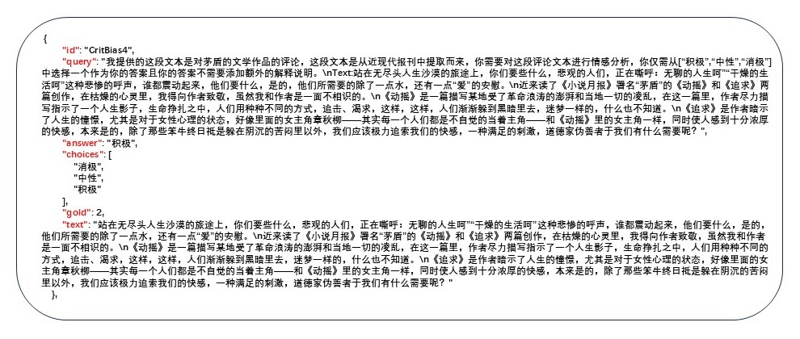
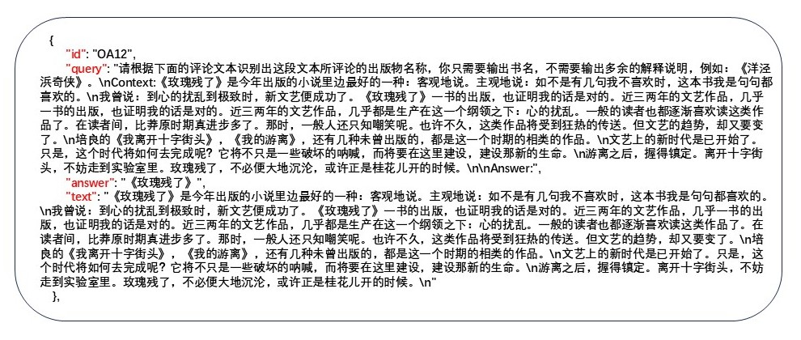
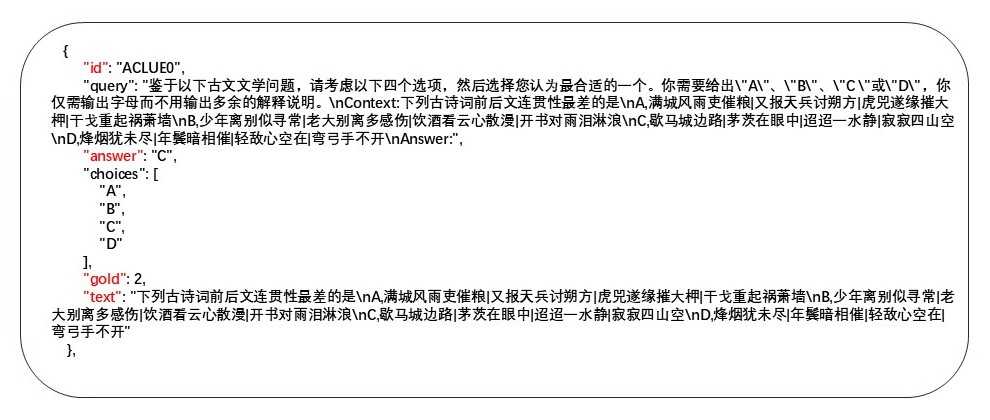
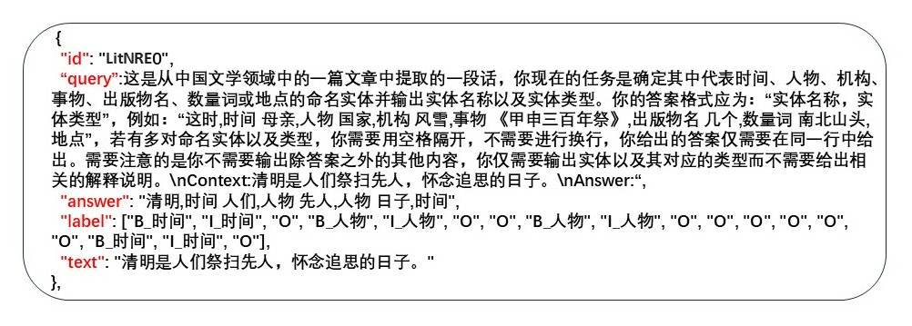
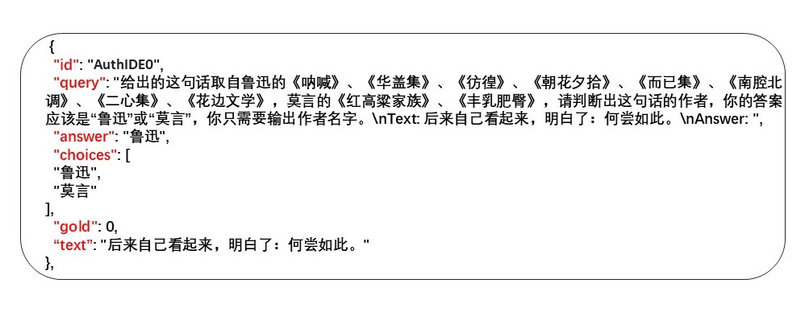

# 2025 CCL25-CLEval  
# 面向中国文学领域的大语言模型性能评测基准

<div>
<div align="left">
&nbsp;&nbsp;云南大学&emsp;
&nbsp;&nbsp;&nbsp;&nbsp;&nbsp;&nbsp;&nbsp;&nbsp;&nbsp;&nbsp;&nbsp;&nbsp;&nbsp;&nbsp;&nbsp;&nbsp;武汉大学&emsp;
&nbsp;&nbsp;&nbsp;&nbsp;&nbsp;&nbsp;&nbsp;&nbsp;&nbsp;&nbsp;&nbsp;&nbsp;&nbsp;&nbsp;&nbsp;四川大学&emsp;
</div>
</div>
<div align="left">
    
    &emsp;&emsp;&emsp;&emsp; <!-- Adds extra spacing between images -->
    
    &emsp;&emsp;&emsp;&emsp; <!-- Adds extra spacing between images -->
    
</div>


## 评测组织者
* 胡刚，云南大学信息学院（研究方向，跨语言智能信息处理）[](hugang@ynu.edu.cn)
* 岳昆，云南大学信息学院（云南省智能系统与计算重点实验室主任）
* 彭敏， 武汉大学计算机学院（中文信息学会，计算机语言学专委）
* 陈思广，四川大学文学与新闻学院 （中国现代长篇小说编年史料研究 ）


## 联系人及联系方式

* 王康，云南大学硕士研究生[](wangkang1@stu.ynu.edu.cn)

## 团队成员(云南大学)
* 王情情
* 于万龙


## 目录

1. [评测背景](#1-评测背景)  
2. [任务介绍](#2-任务介绍)  
    2.1 [现代文学批评倾向](#21-现代文学批评倾向)  
    2.2 [现代文学批评挖掘](#22-现代文学批评挖掘)  
    2.3 [古代文学知识理解](#23-古代文学知识理解)  
    2.4 [文学阅读理解](#24-文学阅读理解)  
    2.5 [文学语言理解](#25-文学语言理解)  
    2.6 [文学作品风格预测](#26-文学作品风格预测)  
    2.7 [文学语言风格转换](#27-文学语言风格转换)
3. [评价标准](#3-模型评测)  
4. [模型评测](#4-模型评测)  
5. [评测赛程](#5-评测赛程)  
6. [结果提交](#6-结果提交)      
7. [报名提交方式及申请本次评测语料使用权](#7-报名提交方式及申请本次评测语料使用权)
8. [奖项设置](#8-奖项设置)
9. [参考文献](#9-参考文献)     


---


## 1 评测背景


* 大语言模型已经成为自然语言处理领域中不可或缺的工具。它们展示了在文本生成、命名实体识别、机器翻译等任务中的多样化能力，并在许多应用场景中取得了显著进展。然而，大型语言模型在中国文学研究中的应用，远远不止于文本生成和自动翻译。例如，通过大模型进行现代文学作品的自动分类和风格分析，可以帮助研究者更好地理解作家的创作特征和文学风格。尽管大模型在中国文学研究中展现出了广阔的前景，其应用仍面临诸多挑战。

* 在处理古典汉语文本时，大模型常因语言的复杂性和多义性而遇到困难；而中国文学文本的高度专业性要求大模型能够有效理解复杂的文学语言及其概念。同时，分析现代文学批评倾向、进行现代文学批评挖掘、理解古代文学知识、预测文学作品风格、进行文学语言风格转换，以及提升文学阅读理解和文学语言理解等任务，迫切需要更多样化和丰富的中文教学语料库。

* 新一代的大语言模型，如Llama-2/3、Qwen1.5/2和InternLM-2，在自然语言理解和执行各种任务方面表现出色。然而，数据的稀缺性和标记化的挑战使得这些模型在处理复杂文学任务时仅能依靠自然语言指令完成相对简单的任务。尤其在中国文学领域，它们的应用和评估面临着巨大挑战，尤其是在多模态开发、教学数据集的多样性等方面。大部分大语言模型是为通用领域设计的，这暴露出专门针对中国文学领域的模型的短缺，这可能会限制相关研究的进一步发展。 此外，缺乏专门为中国文学研究设计的教学数据集，使得研究人员在教学调整时缺乏有效的支持；而缺乏评估基准也使得无法全面、准确地评估和比较大语言模型在中国文学任务中的表现。这对于研究人员来说，形成了一个巨大的瓶颈。

* 为了进一步提升大模型在中国文学语言解析方面的能力，并增强其在细粒度评估上的表现，我们精心构建了七个高质量的数据集。这些数据集不仅覆盖了丰富的文学文本类型，还涉及了多种语言理解任务，旨在推动大模型对中国文学语言的深度理解与精准分析。通过这些数据集的引入，我们期望能够在语言结构、文化内涵和文学风格等方面实现模型的全面提升，从而为中文自然语言处理领域的发展作出贡献。


**评测数据集** :

- [CLEval (CLEval_CritBias)](https://huggingface.co/datasets/ChanceFocus/flare-zh-afqmc)
- [CLEval_(CLEval_CritPred)](https://huggingface.co/datasets/ChanceFocus/flare-zh-stocka)
- [CLEval (CLEval_ACLUE)](https://huggingface.co/datasets/ChanceFocus/flare-zh-corpus)
- [CLEval (CLEval_ReadCom)](https://huggingface.co/datasets/ChanceFocus/flare-zh-fineval)
- [CLEval (CLEval_LitNRE)](https://huggingface.co/datasets/ChanceFocus/flare-zh-fe)
- [CLEval (CLEval_AuthIDE)](https://huggingface.co/datasets/ChanceFocus/flare-zh-nl)
- [CLEval (CLEval_ClaTrans)](https://huggingface.co/datasets/ChanceFocus/flare-zh-nl2)


---

## 2 任务介绍

CLEval提供的7个数据集涵盖了不同类型和风格的中国文学数据，提供了从现代文学批评到古代文学知识的多维度任务。这种多样化的数据集结构对大模型的评估带来了多重优势。不仅丰富了模型的训练和测试内容，涵盖了中国文学的特定文化背景和语言结构，使得大模型的评估结果更加精准，尤其是在语言的细粒度分析和风格迁移方面，而且通过包括文言文等语言结构复杂的文本，这些数据集能够测试大模型对古代汉语的处理能力。数据集的基本信息如下表所示：


|  Data   |               Task               | Text Types |   Raw   | Instruction | Test  |  License   | Source |
|:-------:|:--------------------------------:|:----------:|:-------:|:-----------:|:-----:|:----------:|:--------:|
|   CritBias   |             现代文学批评倾向             |    现代文     |  1,014  |     141    |  141  |            |        |
|   CritPred   |             现代文学批评挖掘             |    现代文     |  1,014  |     829     |  829  |            |        |
|  ACLUE  |             古代文学知识理解             |    古代汉语     | 49,660  |   49,660    | 2,000 |    MIT     | [1]    |
|   ReadCom   |              文学阅读理解              |    现代文     | 29,013  |   29,013    | 2,000 | CC-BY-SA-4.0 | [2]    |
| LitNRE  |              文学语言理解              |    现代文     | 28,894  |   27,864    | 2,750 |   Public   | [3]    |
| AuthIDE  |             文学作品风格预测             |    现代文     | 30,324  |   30,324    | 2,000 |   Public   | [4]    |
|  ClaTrans   |             文学语言风格转换             |    古代汉语     | 972,467 |   972,467   | 2,000 |   MIT   | [5]    |


1. Zhang, Y., & Li, H. (2023). Can large language model comprehend ancient chinese? a preliminary test on aclue. arXiv preprint arXiv:2310.09550.
2. Cui, Y., Liu, T., Chen, Z., Wang, S., & Hu, G. (2016). Consensus attention-based neural networks for Chinese reading comprehension. arXiv preprint arXiv:1607.02250.
3. Xu, J., Wen, J., Sun, X., & Su, Q. (2017). A discourse-level named entity recognition and relation extraction dataset for chinese literature text. arXiv preprint arXiv:1711.07010.
4. https://gitee.com/zhang-chen-peng/Chinese-Authorship-Identification-Dataset

### 2.1 现代文学批评倾向

该数据集的内容来源于现代报刊中的文学评论文章，由四川大学陈思广老师团队精心筛选和提取。首先，从民国时期的多个主流报刊中挑选了涵盖不同文学流派、风格的评论内容，以确保数据的多样性和代表性。所涉及的文学作品包括经典名著、当代畅销书籍以及重要文学事件的评论，广泛覆盖了各类文学作品。因为民国时期报刊中文字存在破损和污染的情况，数据采集团队对相关评论进行了手动筛选和整理，确保每条数据的准确性和相关性。所有摘录的评价都经过精确标注，并进行了必要的格式化处理，以便后续研究使用。通过这一精细的采集和整理过程，最终构建了一个系统且富有深度的文学评价数据集xxx(1922-1949_Origin_AllDocs)，为文学评论分析、情感分析等研究领域提供了宝贵的资源。我们基于XXX（数据集中文名称）构建了两个文学评价数据集：现代文学批评倾向(CritBias)和现代文学批评挖掘(CritPred)。
现代文学批评倾向和现代文学批评挖掘这两个任务，CCL25-CLEval只提供了测试集作为此次任务集的域外数据集，用来评估模型在新任务和领域中的准确性和鲁棒性以及模型的泛化能力。

### 任务内容
该数据集专注于现代文学批评中的情感分析任务，是一个判断文学评价中的情感倾向是积极、中性还是消极的过程。主要以20世纪早期的文学评论为内容，涵盖了多个文学作品的评论实例。其中每个条目都包含一个数据标识符（数据标识符）、输入文本（输入文本）、query（任务提示及输入文本）、answer（正确答案）、choices（分类标签“积极”、“中性”、“消极”）及gold（正确答案在标签中的索引）。通过该数据集，研究人员可以对文学批评文本进行情感倾向的自动识别，推动中文文学评论的情感分析技术发展。数据集的标注确保了每条评论的情感分类准确，为文学批评情感分析、情感分类等领域的研究提供了丰富的素材和支持。

### 数据样例
现代文学批评倾向评测任务提供了一个JSON格式的数据集。以下为相应的数据样例：

[](https://github.com/GoThereGit/Chinese-AMR/blob/main/CAMRP%202022/docs/samples/CAMR_tuple.txt)


#### 数据说明
* `` id ``：数据唯一标识符  
* `` query ``：由两个部分组成，`` 任务提示（prompt） ``以及`` 输入文本（text） ``，其中`` 任务提示（prompt） ``是由人工编写的一种输入指令，用于引导大型语言模型生成特定的输出，帮助模型理解用户需求并产生相关的文本回应。  
* `` answer ``：正确答案  
* `` gold ``：正确答案在情感标签中的索引  
* `` text ``：输入文本（现代文学批评文本）

### 评价标准

#### 评价指标
对于**现代文学批评倾向**的评测任务，我们采用了`` 准确率 (ACC)、F1 Score、Macro F1 和 MCC（(Matthews Correlation Coefficient）[56] ``来全面评估模型的表现。以下是对这些指标的详细说明：  

#### **准确率 (ACC)** 
**准确率 (ACC)** 通过计算预测正确的样本占总样本的比率来测量模型的文本分类效果
计算公式如下：

$$
ACC = \frac{\text{正确预测的样本数}}{\text{总样本数}}
$$

评价指标的说明：
**高ACC值** 表示模型能够精准地判断文学批评中的情感倾向。
**低ACC值** 可能体现模型在理解文本内容或提取出文学批评的情感倾向方面存在不足。

#### **F1 值 (F1 Score)**
**F1 值** 是精确率 (Precision) 和召回率 (Recall) 的调和平均，用于综合评估模型在识别情感正例上的表现，尤其适用于类别不平衡的情感分析任务。它能够在精确率和召回率之间取得平衡，体现模型识别正面或负面情感的整体效果。

**F1 值** 计算公式如下：

$$
F1 = 2 \times \frac{\text{准确率} \times \text{召回率}}{\text{准确率} + \text{召回率}}
$$

在情感倾向分析中，F1 值帮助评估模型识别特定情感（如正面或负面）的精度和完整性。较高的 F1 值表明模型不仅能够准确地识别情感类型，还能覆盖尽可能多的情感样本。

**评价指标的说明：**
- **高 F1 值** 表示模型能有效、全面地识别出评论中的情感倾向。
- **低 F1 值** 则可能表明模型在情感识别上存在遗漏或误判。

#### **Macro F1**
**Macro F1** 是将各情感类别的 F1 值平均，用来衡量模型在不同情感类别上的一致性。Macro F1值能有效反映多类别情感分析任务中模型的均衡表现，尤其在类别比例不均衡的情感数据中，Macro F1尤为重要。

**Macro F1** 计算公式为：

$$
\text{Macro F1} = \frac{1}{N} \sum_{i=1}^N F1_i
$$

在现代文学批评向任务中，Macro F1用于观察模型在各类情感（如积极、消极、中性）上的表现是否均衡。

**评价指标的说明：**
- **高Macro F1值** 表明模型在不同情感类别上都具备稳定的识别能力。
- **低Macro F1值** 则可能说明模型在部分情感类别上表现不佳，表现出类别间的偏差。


#### **MCC（Matthews Correlation Coefficient，马修斯相关系数）**
**MCC** 是一种全面的二分类指标，在情感分析中适合处理类别不均衡的数据，尤其适用于区分明显的正面与负面情感的任务。

**MCC** 计算公式如下：

$$
\text{MCC} = \frac{\sum_{k=1}^{K} \sum_{l=1}^{K} \sum_{m=1}^{K} C_{kk} \cdot C_{lm} - C_{kl} \cdot C_{mk}}{\sqrt{\left(\sum_{k=1}^{K} \sum_{l=1}^{K} C_{kl}\right) \cdot \left(\sum_{k=1}^{K} \sum_{l=1}^{K} C_{lk}\right) \cdot \left(\sum_{k=1}^{K} \sum_{l=1}^{K} C_{kl}\right) \cdot \left(\sum_{k=1}^{K} \sum_{l=1}^{K} C_{lk}\right)}}
$$

**公式符号解释**

- **\( K \)**：类别数（例如，二分类时 \( K = 2 \)，三分类时 \( K = 3 \) 等）。
- **\( C_{kk} \)**：混淆矩阵的对角线元素，表示模型正确分类为第 \( k \) 类的样本数（即真阳性数）。
- **\( C_{kl} \)**：第 \( k \) 类被误分类为第 \( l \) 类的样本数（即第 \( k \) 类的假阳性数）。
- **\( C_{lm} \)** 和 **\( C_{mk} \)**：分别表示第 \( l \) 类和第 \( m \) 类之间的交叉误分类数，用于多分类任务的误分类计数。

在情感倾向分析中，MCC 评估模型对各情感类别的平衡性。相比其他指标，MCC 能更有效地反映模型在复杂情感分析任务中的稳定性和整体适应性。

**评价指标的说明：**
- **高 MCC 值** 表示模型在正负情感类别之间具有良好的平衡，分类准确。
- **低 MCC 值** 则可能表明模型在某些类别上产生了过多误判，情感倾向识别不准确。

#### 评测表现

| 模型名称             | ACC     | F1 Score | Macro F1 | MCC     | Average   |
|:------------------------:|:---------:|:----------:|:----------:|:---------:|:-----------:|
| bloomz-7b1             | 0.0709  | 0.1157   | 0.0647   | 0.1157  | 0.0918    |
| Baichuan-7B            | 0.0213  | 0.0353   | 0.0495   | 0.0285  | 0.03365   |
| Llama-2-7b-hf          | 0.0426  | 0.074    | 0.0875   | 0.0782  | 0.070575  |
| Baichuan2-7B-Base      | 0.0071  | 0.014    | 0.0078   | -0.0323 | -0.00085  |
| Qwen-7B                | 0.1418  | 0.234    | 0.169    | 0.11    | 0.1637    |
| Xunzi-Qwen1.5-7B       | 0.4043  | 0.4508   | 0.3435   | 0.182   | 0.34515   |
| Qwen1.5-7B             | 0.227   | 0.3367   | 0.2783   | 0.1421  | 0.246025  |
| internlm2-7b           | 0.3901  | 0.4751   | 0.3966   | 0.2157  | 0.369375  |
| Llama-3-8B             | 0.0213  | 0.036    | 0.0509   | 0.035   | 0.0358    |
| Qwen2-7B               | 0.156   | 0.2309   | 0.1936   | 0.0624  | 0.160725  |


---


## 2.2 现代文学批评挖掘

### 任务内容
现代文学批评挖掘是一个从评论文本中提取出被评论的出版物名称的过程。该数据集同样基于文学评价数据集(1922-1949_Origin_AllDocs)来构建，以20世纪早期的文学评论为主要内容，包含多个评论实例，每个实例包括id（标识符）、text（评论文本）、prompt（任务提示和评论文本）以及answer（正确答案）。通过该数据集。数据集的标注涵盖了评论文本中涉及的作品名称，为中文文本的自动信息提取与分析提供了重要的资源。

#### 数据样例
现代文学批评挖掘评测任务提供了一个JSON格式的数据集。以下为相应的数据样例：

[ ](https://github.com/GoThereGit/Chinese-AMR/blob/main/CAMRP%202022/docs/samples/CAMR_tuple.txt)


#### 数据说明
* `` id ``：数据唯一标识符  
* `` query ``：由两个部分组成，`` prompt（任务提示） ``以及`` 输入文本（text） ``  
* `` answer ``：正确答案  
* `` text ``：输入文本（现代文学评价文本）

### 评价标准

#### 评价指标
在本任务中，使用`` 准确率（ACC） ``来衡量模型在从评论文本中正确识别和提取被评论的出版物名称的能力。

#### 评价指标的说明：
* 高准确率 表示模型能够高效、精准地识别出评论中的出版物名称。
* 低准确率 可能表明模型在理解文本内容、区分相关信息或提取出版物名称方面存在困难。

#### 评测表现

| 模型名称        | ACC     | 模型名称              | ACC     |
|:-------------:|:-------:|:-----------------:|:-------:|
| bloomz-7b1    | 0.1809  | Baichuan-7B         | 0.0446  |
| Llama-2-7b-hf | 0       | Baichuan2-7B-Base   | 0.1858  |
| Qwen-7B       | 0       | Xunzi-Qwen1.5-7B    | 0       |
| Qwen1.5-7B    | 0.1604  | internlm2-7b        | 0.7346  |
| Llama-3-8B    | 0.1303  | Qwen2-7B            | 0       |

---


## 2.3 古代文学知识理解

### 任务内容
本任务使用了古汉语语言理解评估基准[50]作为数据集，我们对其进行了格式转换。该数据集包含了一系列古文文学问题，主要用于评估模型选择最合适的答案的能力。每个问题提供了一个上下文和四个选项（“A”、“B”、“C”、“D”），模型需根据上下文进行判断，选出正确的答案。问题涵盖了古诗词中前后文连贯性、古文解析、诗词理解和文化背景等多个方面，适合用于中文文学教学或考试评估。该任务旨在评估模型对古代文学知识的理解能力。

### 数据样例
该任务提供了一个JSON格式的数据集，其中每个条目都包含一个id（数据标识符）、text（问题及ABCD四个选项的内容）、query（任务提示及输入文本）、answer（正确答案）、choices（答案标签“A”、“B”、“C”、“D”）及gold（正确答案在标签中的索引）。以下为相应的数据样例：

[ ](https://github.com/GoThereGit/Chinese-AMR/blob/main/CAMRP%202022/docs/samples/CAMR_tuple.txt)


### 评价标准

#### 评价指标
该任务采用`` 准确率 (ACC)、F1 Score、Macro F1 和 MCC（(Matthews Correlation Coefficient） ``来评估模型的表现。  

#### 评测表现

| 模型名称          | ACC     | F1 Score | Macro F1 | MCC    | 平均指标 |
| :-----------------:|:-------:|:--------:|:--------:|:------:|:--------:|
| bloomz-7b1        | 0.3125  | 0.2879   | 0.2853   | 0.086  | 0.2429   |
| Baichuan-7B       | 0.2665  | 0.2256   | 0.2283   | 0.0293 | 0.1874   |
| Llama-2-7b-hf     | 0.2625  | 0.174    | 0.1692   | 0.0102 | 0.154    |
| Baichuan2-7B-Base | 0.301   | 0.2678   | 0.2646   | 0.0748 | 0.2271   |
| Qwen-7B           | 0.2595  | 0.1083   | 0.1049   | 0.0264 | 0.1248   |
| Xunzi-Qwen1.5-7B  | 0.2755  | 0.1756   | 0.1731   | 0.0491 | 0.1683   |
| Qwen1.5-7B        | 0.3995  | 0.3906   | 0.3909   | 0.2105 | 0.3479   |
| internlm2-7b      | 0.475   | 0.467    | 0.468    | 0.317  | 0.4318   |
| Llama-3-8B        | 0.277   | 0.1957   | 0.1932   | 0.0429 | 0.1772   |
| Qwen2-7B          | 0.495   | 0.4821   | 0.4818   | 0.3377 | 0.4492   |

---


### 2.4 文学阅读理解

机器智能的终极目标之一是实现对人类语言的深度阅读与理解。在众多机器阅读理解任务中，完形填空式阅读理解因其独特的挑战性吸引了大量研究者的关注。此类任务旨在让模型理解给定的上下文或文档，并通过分析语句的逻辑与语义，填补特定缺失的信息。任务要求模型能够从文本中精准提取适当的词语或字，以完成填空。该任务任务全面考察了模型在复杂语境中的理解能力，包括上下文的逻辑一致性及信息提取的准确性。它不仅是自然语言处理（NLP）领域中的关键能力指标，还在文学相关任务中具有重要意义。通过模拟真实的语言使用场景（如教育类阅读填空题），此任务为大语言模型在生成式任务的训练和评估提供了重要基准数据。更广泛地，该任务有助于提升模型在教育应用中的智能化表现，以及在文学分析、文本摘要等领域的实用性，为相关研究和应用场景提供了强有力的技术支持。

### 任务内容

本任务使用了Chinese-Cloze-RC[]作为数据集,该数据集是根据儿童童话构建的，要求模型根据给定的文学文本，进行阅读理解和关键信息提取来填补缺失的信息（如空格处的XXXXX）。

### 数据样例
该任务提供了一个JSON格式的数据集，其中每个条目都包含一个id（数据标识符）、text（输入文本）、query（任务提示及输入文本）、answer（正确答案）。以下为相应的数据样例：

[ ](https://github.com/GoThereGit/Chinese-AMR/blob/main/CAMRP%202022/docs/samples/CAMR_tuple.txt)


### 评价指标

#### 评价标准

该任务采用`` 准确率 (ACC) ``来评估模型的表现。  

#### 评价指标的说明：  
* **高ACC值** 表示模型在文学阅读理解任务中，能够准确理解文本的语义和上下文逻辑，并成功完成信息填补任务，如提取正确的词语或汉字，展现出较强的文本理解和推理能力。  
* **低ACC值** 则可能反映出模型在以下方面存在不足：对复杂语境的理解能力较弱，难以抓住文本中隐含的语义联系，或无法准确提取所需信息以完成填空。

#### 评测表现

| Model                   | ACC     | Model                 | ACC     |
|:-------------------------:|:---------:|:-----------------------:|:---------:|
| bloomz-7b1             | 0.0053  | Baichuan-7B          | 0       |
| Llama-2-7b-hf          | 0       | Baichuan2-7B-Base    | 0.001   |
| Qwen-7B                | 0       | Xunzi-Qwen1.5-7B     | 0       |
| Qwen1.5-7B             | 0.013   | internlm2-7b         | 0.0185  |
| Llama-3-8B             | 0       | Qwen2-7B             | 0.038   |

---


### 2.5 文学语言理解

文学语言理解是一项旨在通过自然语言处理技术（NLP）来分析和理解文学文本的任务。它关注模型对文学作品中复杂语境、语义关系及隐喻表达的理解能力，需要模型生成高质量的语义输出。通过这些任务，模型能够应对文学文本中语境复杂性和多义性的问题。文学语言理解在教育、文化和技术领域具有广泛应用价值，例如支持智能教学、促进文学分析，同时也为语言模型的通用性和细致性提供了高标准的评估基准。这使其成为人工智能与人文科学结合的重要方向之一。

### 任务内容

我们使用了Chinese-Literature-NER-RE-Dataset[]作为文学语言理解任务的数据集,该数据集需要模型准确识别文学文本中的命名实体（Named Entities），并对其进行分类。识别的实体包括时间、人物、机构、事物、出版物名、数量词和地点，并输出其名称及对应类型。这类任务不仅关注基本实体的识别，还要求对上下文进行精细化理解以分类实体属性。文学文本通常语言表达丰富，包含隐喻、象征等复杂语义结构，对实体识别提出了更高的要求。模型需要深入分析句子中的语境、句法以及角色关系。

### 数据样例
该任务提供了一个JSON格式的数据集，其中每个条目都包含一个id（数据标识符）、text（文学文本）、query（任务提示及输入文本）、answer（正确答案）及label（每个单词或短语分配的标签，用来标识其类别或类型。）。以下为相应的数据样例：

[ ](https://github.com/GoThereGit/Chinese-AMR/blob/main/CAMRP%202022/docs/samples/CAMR_tuple.txt)


### 评价标准
该任务采用`` Entity F1 ``来评估模型的表现。`` Entity F1 `` 是评估命名实体识别（NER）任务中模型性能的重要指标之一。它结合了``  精确率（Precision） ``和`` 召回率（Recall） ``的权衡，反映了模型在识别实体方面的综合能力。该指标特别适合评估实体边界和分类是否正确。

**精确率 (Precision, \( P \))**：
精确率衡量的是模型预测的实体中有多少是正确的。高精确率意味着模型的预测准确性较高，错误的预测较少。

$$
P = \frac{\text{正确识别的实体数}}{\text{预测的实体总数}}
$$

**召回率 (Recall, \( R \))**：
召回率衡量的是所有实际存在的实体中，模型能够正确识别出多少。高召回率意味着模型能够识别出更多的实体，但可能包含一些错误的预测。

$$
R = \frac{\text{正确识别的实体数}}{\text{实际的实体总数}}
$$

**Entity F1 Score**：

$$
\text{Entity F1} = 2 \cdot \frac{P \cdot R}{P + R}
$$

其中：
* **正确识别的实体**：模型预测的实体类别和边界完全与真实标签一致。
* **预测的实体总数**：模型输出的实体数量。
* **真实实体总数**：数据集中标注的真实实体数量。

#### 评价指标的说明
- 高**Entity F1**值：模型在精确率和召回率之间达到了较好的平衡，预测结果准确且能识别出大部分实际存在的实体。  
- 低**Entity F1**值：模型的预测结果不准确，或者在识别实体时漏掉了很多实际存在的实体，或错误的预测了过多的实体。

#### 评测表现

| 模型名称           | Entity F1 | 模型名称           | Entity F1 |
|:------------------------:|:---------------:|:------------------------:|:---------------:|
| bloomz-7b1            | 0             | Baichuan-7B           | 0.0298        |
| Llama-2-7b-hf         | 0.0072        | Baichuan2-7B-Base     | 0.0026        |
| Qwen-7B               | 0             | Xunzi-Qwen1.5-7B      | 0.0049        |
| Qwen1.5-7B            | 0.0138        | internlm2-7b          | 0.0281        |
| Llama-3-8B            | 0.0867        | Qwen2-7B              | 0.0058        |

---


### 2.6 文学作品风格预测

文学作品风格预测任务旨在通过分析文本的语言特征、句法结构和主题内容，判断其所属的作者或文体风格。这一任务聚焦于文本内部的风格差异，包括语言表达、句式选择、情感倾向以及语境背景等要素。任务中的作者或文学文本来自不同时代，语言风格和文化背景差异显著，为模型的判断能力提供了挑战。

### 任务内容

我们使用了中文作者身份识别数据集[]作为文学作品风格预测任务的数据集,该数据集需要模型准确识别出给定的文学文本中的文体风格，并判断给定的文本的作者是谁。这一数据集通过在文学作品间设计风格辨别任务，有助于更全面地评估模型的自然语言理解能力以及风格归因能力并且不同时代和文化背景的作家使用的语言表达方式存在较大差异，通过识别作者风格，可以测试模型是否能够适应多样化的语境。

### 数据样例
该任务提供了一个JSON格式的数据集，其中每个条目都包含一个id（数据标识符）、text（文学文本）、query（任务提示及输入文本）、answer（正确答案）、choices（作者标签“鲁迅”、“莫言”）及gold（正确答案在标签中的索引）。以下为相应的数据样例：

[ ](https://github.com/GoThereGit/Chinese-AMR/blob/main/CAMRP%202022/docs/samples/CAMR_tuple.txt)


### 评价标准

#### 评价指标
该任务采用`` 准确率 (ACC)、F1 Score、Macro F1 和 MCC（(Matthews Correlation Coefficient） ``来评估模型的表现。  

#### 评测表现

| 模型名称          | ACC   | F1 Score | Macro F1 | MCC   | 平均指标 |
|:-----------------------:|:-----------:|:--------------:|:--------------:|:-----------:|:--------------:|
| bloomz-7b1       | 0.3935    | 0.3181       | 0.3181       | 0.0557    | 0.2714       |
| Baichuan-7B      | -         | -            | -            | -         | -            |
| Llama-2-7b-hf    | 0.4441    | 0.3489       | 0.3489       | 0.0043    | 0.2866       |
| Baichuan2-7B-Base| 0.4048    | 0.3835       | 0.3835       | 0.1541    | 0.3315       |
| Qwen-7B          | 0.217     | 0.2504       | 0.2504       | 0.0557    | 0.1934       |
| Xunzi-Qwen1.5-7B | 0.6555    | 0.6476       | 0.6476       | 0.3492    | 0.575        |
| Qwen1.5-7B       | 0.5318    | 0.4817       | 0.4817       | 0.1705    | 0.4164       |
| internlm2-7b     | 0.794     | 0.8015       | 0.8015       | 0.6125    | 0.7524       |
| Llama-3-8B       | 0.4603    | 0.4852       | 0.4852       | 0.0631    | 0.3735       |
| Qwen2-7B         | 0.5       | 0.5          | 0.4735       | 0.2017    | 0.4188       |

---


### 2.7 文学语言风格转换

文学语言转换是自然语言处理（NLP）领域的一项任务，旨在让模型实现一种文学语言形式向另一种文学语言形式的有效转换。这种任务的关键在于对源文本风格、语境、修辞手法以及情感表达的深刻理解，并在目标语言或形式中予以恰当保留或重现。

### 任务内容

我们使用了Classical-Modern[]作为文学语言风格转换的数据集,该数据集专注于文言文翻译任务，其内容包含多个文言文句子及其现代汉语翻译对。这些数据示例涵盖了中国古代语言的多样性，涉及历史、哲学、文学等领域，充分体现了文言文的精炼特点和文化背景。数据集中的句子经过标准化，既保留了文言文的典型表达方式，又确保翻译的现代汉语通俗易懂。文言文的语法结构与现代汉语差异显著，翻译任务可以锻炼模型对复杂语言形式的解析和理解能力，有助于提升模型的跨语言迁移能力并且中文言文的表达方式具有高度的语言压缩和多义性，可以有效提升模型对多义句和复杂上下文的处理能力，促进模型在低资源语言场景中的适应能力。

### 数据样例
该任务提供了一个JSON格式的数据集，其中每个条目都包含一个id（数据标识符）、text（古代汉语文本）、query（任务提示及输入文本）、answer（正确答案）。以下为相应的数据样例：

[ ](https://github.com/GoThereGit/Chinese-AMR/blob/main/CAMRP%202022/docs/samples/CAMR_tuple.txt)


### 评价标准

#### 评价指标
该任务采用`` BERTScore-F1 ``和`` BARTScore ``两个指标来评估模型的表现。  

#### **BERTScore-F1：**
BERTScore 是基于 BERT 模型的文本相似度评估指标，BERTScore-F1 值是基于 精确度（Precision） 和 召回率（Recall） 的调和平均。

$$
\text{F1} = 2 \cdot \frac{\text{Precision} \cdot \text{Recall}}{\text{Precision} + \text{Recall}}
$$

其中：
**精确度（Precision）** 和 **召回率（Recall）** 是基于 BERT 特征表示计算的：
* **精确度（Precision）**: 参考文本中每个词的嵌入与生成文本中对应词嵌入的相似度的最大值。
* **召回率（Recall）**: 生成文本中每个词的嵌入与参考文本中对应词嵌入的相似度的最大值。

#### **BARTScore：**
BARTScore 是基于预训练的 BART 模型来评估生成文本质量的指标。BARTScore 通过计算生成文本与参考文本之间的文本重构误差来评估模型的生成质量。

$$
\text{BARTScore} = \frac{1}{N} \sum_{i=1}^{N} \text{BART}(\text{参考文本}_i, \text{生成文本}_i)
$$

其中：
* **N** 是文本对的数量（参考文本与生成文本的数量）。
* **BART(参考文本, 生成文本)** 是通过 BART 模型计算的参考文本和生成文本之间的重构误差。

#### 评价指标的说明
- BERTScore-F1 越大，表示生成文本和参考文本的相似度越高，意味着模型生成的文本越能捕捉到参考文本的内容。因此，F1值越大，表示生成文本质量越好。
- BARTScore 越高，表示生成文本和参考文本之间的相似度越高，生成的文本质量越好。BARTScore 主要关注生成文本在重构参考文本时的表现，重构误差较低意味着生成的文本质量较高，因此，BARTScore 越大，表示生成文本质量越好。

#### 评测表现

| 模型名称         |  BERTScore-F1  |   BARTScore   |  平均指标   |
|:---------------:|:-------------:|:-------------:|:----------:|
| bloomz-7b1      |    0.1358     |    -7.6459    |  -3.75505  |
| Baichuan-7B     |    0.5839     |    -5.5184    |  -2.46725  |
| Llama-2-7b-hf   |    0.5607     |    -5.7123    |  -2.5758   |
| Baichuan2-7B-Base |   0.6551     |     0.5049    |   0.58     |
| Qwen-7B         |    0.5653     |    -5.4548    |  -2.44475  |
| Xunzi-Qwen1.5-7B |   0.5993     |    -4.8714    |  -2.13605  |
| Qwen1.5-7B      |    0.6195     |    -5.2896    |  -2.33505  |
| internlm2-7b    |    0.7005     |    -5.5885    |  -2.444    |
| Llama-3-8B      |    0.5458     |    -5.7946    |  -2.6244   |
| Qwen2-7B        |    0.6294     |    -7.6459    |  -3.50825  |

---


## 3 评价标准

各任务使用的评价指标如下表所示：


| Task                      | Data     | Test  | Metrics                          |
|:---------------------------:|:--------:|:-----:|:---------------------------------:|
| 现代文学批评倾向            | CritBias      | 829   | ACC, F1, macro-F1, mcc                                |
| 现代文学批评挖掘            | CritPred      | 141   | ACC           |
| 古代文学知识理解            | ACLUE    | 2,000 | ACC, F1, macro-F1, mcc           |
| 文学阅读理解                | ReadCom      | 2,000 | ACC                               |
| 文学语言理解                | LitNRE   | 2,750 | Entity F1                         |
| 文学作品风格预测            | AuthIDE   | 2,000 | ACC, F1, macro-F1, mcc           |
| 文学语言风格转换            | ClaTrans     | 2,000 | BERTScore-F1, BARTScore          |


各指标详细计算过程详情请看[**第二章任务介绍**](#2-任务介绍)

任务的平均指标如下表所示：


| 模型名称          | CritBias | CritPred | ACLUE  | ReadCom | LitNRE | AuthIDE  | ClaTrans  |
|:-----------------:|:--------:|:--------:|:------:|:-------:|:------:|:--------:|:---------:|
| bloomz-7b1        | 0.0564   | 0.1809   | 0.2429 | 0.0053  | 0      | 0.2713   | -3.75505  |
| Baichuan-7B       | 0.0337   | 0.0446   | 0.1874 | 0       | 0.0298 | -2.46725 | XXX|
| Llama-2-7b-hf     | 0.0705   | 0        | 0.154  | 0       | 0.0072 | 0.2866   | -2.5758   |
| Baichuan2-7B-Base | -0.0009  | 0.1858   | 0.2271 | 0.001   | 0.0026 | 0.3315   | 0.58      |
| Qwen-7B           | 0.1637   | 0        | 0.1248 | 0       | 0      | 0.1934   | -2.44475  |
| Xunzi-Qwen1.5-7B  | 0.3452   | 0        | 0.1683 | 0       | 0.0049 | 0.575    | -2.4435   |
| Qwen1.5-7B        | 0.246    | 0.1604   | 0.3479 | 0.013   | 0.0138 | 0.4164   | -2.33505  |
| internlm2-7b      | 0.3694   | 0.7346   | 0.4318 | 0.0185  | 0.0281 | 0.7524   | -2.444    |
| Llama-3-8B        | 0.0358   | 0.1303   | 0.1772 | 0       | 0.0867 | 0.3735   | -2.6244   |
| Qwen2-7B          | 0.1607   | 0.1641   | 0.4492 | 0.038   | 0.0058 | 0.4122   | -2.31345  |

---


## 4 模型评测


#### 本地部署
```bash
git clone https://github.com/isShayulajiao/CLEval1.git
cd CLEval
pip install -r requirements.txt
cd CLEval/src/literature-evaluation
pip install -e .[multilingual]
```


#### 自动化任务评测

在评估之前，请下载[BART模型](https://drive.google.com/u/0/uc?id=1_7JfF7KOInb7ZrxKHIigTMR4ChVET01m&export=download)到'src/metrics/BARTScore/bart_score.pth'。  

- `` BART模型 ``是一个用来评测文学语言风格转换任务的预训练模型。  

对于自动化评测，请观看以下操作提示：

1. Huggingface Transformer

   若要评估托管在 HuggingFace Hub 上的模型（例如，Baichuan2-7B-Base），请使用以下命令：

```bash
python src/eval.py \
    --model hf-causal-vllm \
    --tasks flare_CritBias \
    --model_args use_accelerate=True,pretrained=baichuan-inc/Baichuan2-7B-Base,tokenizer=baichuan-inc/Baichuan2-7B-Base,max_gen_toks=1024,use_fast=False,dtype=float16,trust_remote_code=True 
```
* 若您的模型存放在本地，`` pretrained ``和`` tokenizer ``应该填写模型存放在本地的地址。
* 评测文学语言风格转换任务时，`` max_gen_toks ``建议设置成`` 20 ``；评测现代文学批评挖掘、文学阅读理解和文学语言理解这三个任务时，`` max_gen_toks ``建议设置成`` 200 ``。


常见模型使用的`` model ``参数如下表所示:

| 模型名称                   | model参数       | 模型名称                | model参数       |
|:-------------------------:|:------------------:|:---------------------:|:------------------:|
| bloomz_7b1              | hf-causal-vllm   | Baichuan-7B         | hf-causal-llama  |
| Llama-2-7b-hf           | hf-causal-llama  | Baichuan2-7B-Base   | hf-causal-vllm   |
| Qwen-7B                 | hf-causal-vllm   | Xunzi-Qwen1.5-7B    | hf-causal-vllm   |
| Qwen1.5-7B              | hf-causal-vllm   | internlm2-7b        | hf-causal-vllm   |
| Llama-3-8B              | hf-causal-vllm   | Qwen2-7B            | hf-causal-vllm   |


2. API

```bash
export OPENAI_API_SECRET_KEY=YOUR_KEY_HERE
python eval.py \
    --model gpt-3.5-turbo \
    --tasks CLEval_aclue,CLEval_authide,CLEval_critpred
```

---


## 5 评测赛程

## 5.1 赛程

&emsp;&emsp;2024年4月10日：报名截止；

&emsp;&emsp;2025年3月-5月：各任务开展技术评测；

&emsp;&emsp;2025年5月xx日：测试集结果提交截止；

&emsp;&emsp;2025年5月31日：评测任务结束，公布参赛队伍的成绩和排名（并非最终排名，还需参考技术报告）；

&emsp;&emsp;2025年6月10日：提交中文或英文技术报告；

&emsp;&emsp;2025年6月20日：评测论文审稿 & 录用通知；

&emsp;&emsp;2025年7月1日：评测论文纠错排版 & 提交ACL/CCL Anthology收录；

&emsp;&emsp;2028年8月：CCL 2025技术评测研讨会

## 5.2 报告格式

- 报告可由中文或英文撰写。

- 报告统一使用CCL 2025 的[论文模版](http://cips-cl.org/static/CCL2024/downloads/ccl2023_template.zip)。

- 报告应至少包含以下四个部分：模型介绍、评测结果、结果分析与讨论和参考文献。

---


## 6 结果提交

参赛队伍在测试集上参与评测，结果集使用ccleval评测框架最终生成的数据格式。

提交的压缩包命名为**队伍名称+result.zip**，其中包含七个任务的预测文件以及两个excel指标文件。  
  
result.zip  
CritBias.json  
CritPred.json  
ACLUE.json  
ReadCom.json  
LitNRE.json  
AuthIDE.json  
ClaTrans.json  
metrics.xlsx  
metrics_Avg.xlsx  
1. 七个任务的预测文件需严格命名为OA1.json、OA2.json、ACLUE.json、cft.json、NER_re.json、author.json和tsla.json。  
2. 请严格使用**队伍名称+result.zip**对OA1.json、OA2.json ACLUE.json、cft.json、NER_re.json、author.json、tsla.json、metrics.xlsx和metrics_Avg.xlsx进行压缩，即要求解压后的文件不能存在中间目录。 选⼿可以只提交部分任务的结果，如只提交“现代文学批评倾向 ”任务，未预测任务的分数默认为0。  
3. metrics.xlsx和metrics_Avg.xlsx文件填写示例，请在[这里](https://drive.google.com/u/0/uc?id=1_7JfF7KOInb7ZrxKHIigTMR4ChVET01m&export=download)下载
本次评测结果集采用邮件方式进行提交。参赛队伍负责人以  
**队伍名称 + CCL2025-CLEval2025结果提交**为邮件标题，将结果文件直接发送到 **wangkang1@stu.ynu.edu.cn** ，以提交时间截止前您的最后一次提交结果为准。

### 排名

1. 所有评测任务均采用百分制分数显示，小数点后保留4位有效数字。
2. 排名取各项任务得分的平均值在所有参赛队伍中的排名，即： 

$$\text{最终得分} = \frac{\sum_{i=1}^{n} \text{任务得分}_i}{n}$$

其中，**任务得分** 的取值为该任务所有评估指标的平均值。具体地，对于每个任务：  

$$\text{任务得分} = \frac{\sum_{j=1}^{m} \text{指标得分}_j}{m}$$

其中：
- n 表示任务总数。
- m 表示该任务的评估指标总数。
- $\text{指标得分}_j$表示该任务的第 j 个指标得分。

---


## 7 报名提交方式及申请本次评测语料使用权

点击报名链接填写报名表 https://f.kdocs.cn/g/aYC93cfz/ 进行报名，我们会发送邮件确认您已经参赛。  
  
如需要本次评测提供的语料库，请参赛队伍在[**huggingface**](https://drive.google.com/u/0/uc?id=1_7JfF7KOInb7ZrxKHIigTMR4ChVET01m&export=download)申请本次评测语料使用权

---


## 8 奖项设置

本次评测将设置一、二、三等奖，中文信息学将会为本次评测获奖队伍提供荣誉证书。


\documentclass{article}
\usepackage{booktabs}  % 支持三线表
\usepackage{multirow}  % 支持合并单元格
\usepackage{array}     % 支持表格对齐优化

\begin{document}

\begin{table}[ht]
\centering
\begin{tabular}{c c c c c c c c}
\toprule
\textbf{任务来源} & \textbf{任务名称} & \textbf{数据集名称} & \textbf{原始数据集大小} & \textbf{指令数据集大小} & \textbf{评估数据集大小} & \textbf{数据来源} & \textbf{版权} \\
\midrule
\multirow{2}{*}{\centering \vfill 人工构建 \vfill} 
  & \multirow{2}{*}{\centering \vfill 现代文学批评倾向 \vfill} & CritBias & 1,014 & 829 & 829 & 现代报刊 & Private \\
  &  & CritPred & 1,014 & 141 & 141 & 现代报刊 & Private \\
\midrule
\multirow{10}{*}{\centering \vfill 公开数据集 \vfill} 
  & \multirow{2}{*}{\centering \vfill 古代文学知识理解 \vfill} & ACLUE & 49,660 & 49,660 & 14,298 & 公开资源和自动生成的古代汉语语料库 & MIT \\
  &  & CHED & 119,780 & 119,780 & 35,334 & 古代书籍 & Public \\
\cmidrule{2-8}
  & \multirow{2}{*}{\centering \vfill 文学阅读理解 \vfill} & ReadCom & 29,013 & 29,013 & 8,103 & 儿童故事书 & CC-BY-SA-4.0 \\
  &  & NCR & 8,390 & 20,349 & 2,434 & 初高中语文阅读理解单选题 & Public \\
\cmidrule{2-8}
  & \multirow{3}{*}{\centering \vfill 文学语言理解 \vfill} & AdvExt & 17,092 & 16,819 & 4,445 & 中国现代文学作品 & Public \\
  &  & LitNRE & 28,897 & 27,864 & 1,822 & 公共网站 & Public \\
  &  & TouTiaoCls & 382,688 & 382,688 & 114,206 & 今日头条客户端 & Public \\
\cmidrule{2-8}
  & \multirow{2}{*}{\centering \vfill 文学作品风格预测 \vfill} & AuthIDE & 30,324 & 30,324 & 6,066 & 中国现代文学作品 & Public \\
  &  & PoePred & 958 & 8,613 & 861 & 公共网站 & MIT \\
\bottomrule
\end{tabular}
\caption{数据集信息}
\end{table}

\end{document}


